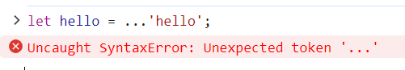
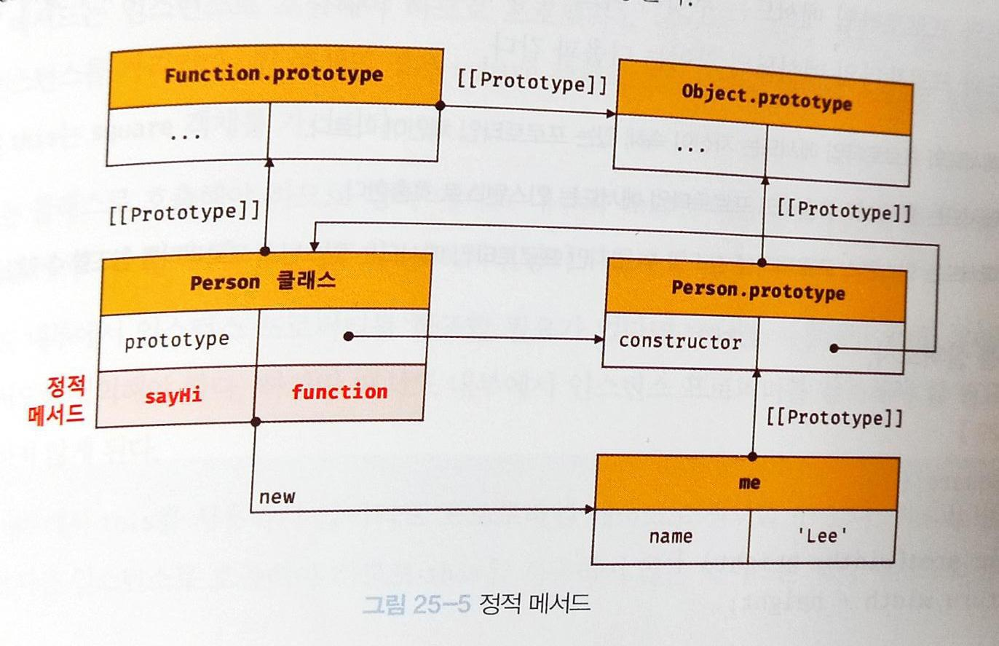

# 스프레드 문법
ES6에서 도입된 스프레드 문법 ( 전개 문법 ) `...`은 하나로 뭉쳐 있는 여러 값들의 집합을 펼쳐서 개별적인 값들의 목록으로 만든다.

`Array`, `String`, `Map`, `Set`, `Dom 컬렉션`, `arguments` 와 같이 `for ... of` 문으로 순회할 수 있는 이터러블에 한정된다.


#### 예제 35-01

```javascript
// ...[1, 2, 3]은 [1, 2, 3]을 개별 요소로 분리한다(→ 1, 2, 3)
console.log(...[1, 2, 3]); // 1 2 3

// 문자열은 이터러블이다.
console.log(...'Hello'); // H e l l o

// Map과 Set은 이터러블이다.
console.log(...new Map([['a', '1'], ['b', '2']])); // [ 'a', '1' ] [ 'b', '2' ]
console.log(...new Set([1, 2, 3])); // 1 2 3

// 이터러블이 아닌 일반 객체는 스프레드 문법의 대상이 될 수 없다.
console.log(...{ a: 1, b: 2 });
// TypeError: Found non-callable @@iterator
```

`1 2 3` 은 값이 아니라 값들의 목록이다.
=> 스프레드 문법의 결과는 값이 아니다. => 스프레드 문법의 결과는 변수에 할당할 수 없다.

#### 예제 35-02

```javascript
// 스프레드 문법의 결과는 값이 아니다.
const list = ...[1, 2, 3]; // SyntaxError: Unexpected token ...
```


스프레드 문법의 결과물은 값으로 사용할 수 없다.



쉼표로 구분한 값의 목록을 사용하는 문맥에서만 사용가능하다.

- 함수 호출문의 인수 목록
- 배열 리터럴의 요소 목록
- 객체 리터럴의 프로퍼티 목록

<br/>
<br/>

## 35.1 함수 호출문의 인수 목록에서 사용하는 경우

배열을 펼쳐서 개별적인 값들의 목록으로 만들고 함수의 인수 목록으로 전달해보자.

#### 예제 35-03

```javascript
const arr = [1, 2, 3];

// 배열 arr의 요소 중에서 최대값을 구하기 위해 Math.max를 사용한다.
const max = Math.max(arr); // -> NaN
```

#### 예제 35-04 : `Math.max()` 란?

```javascript
Math.max(1);       // -> 1
Math.max(1, 2);    // -> 2
Math.max(1, 2, 3); // -> 3
Math.max();        // -> -Infinity
```

`Math.max()`는 개수가 정해져 있지 않은 여러 개의 숫자를 인수로 전달받아 인수 중에서 최대값을 반환한다.

#### 예제 35-05 : 문제 상황

```javascript
Math.max([1, 2, 3]); // -> NaN
```

숫자가 아닌 배열을 인수로 전달하면 `NaN`을 반환한다.

<br/>
<br/>

### 해결법

배열을 펼쳐서 요소들을 개별적인 값들의 목록으로 만든 후, `Math.max` 의 인수로 전달해야 한다.

#### 예제 35-06 : 스프레드 문법 이전의 해결방법

```javascript
var arr = [1, 2, 3];

// apply 함수의 2번째 인수(배열)는 apply 함수가 호출하는 함수의 인수 목록이다.
// 따라서 배열이 펼쳐져서 인수로 전달되는 효과가 있다.
var max = Math.max.apply(null, arr); // -> 3
```
`Function.prototype.apply` 사용


#### 예제 35-07 : 스프레드 문법을 사용한 해결방법

```javascript
const arr = [1, 2, 3];

// 스프레드 문법을 사용하여 배열 arr을 1, 2, 3으로 펼쳐서 Math.max에 전달한다.
// Math.max(...[1, 2, 3])은 Math.max(1, 2, 3)과 같다.
const max = Math.max(...arr); // -> 3
```

<br/>
<br/>

### 혼동 주의

Rest 파라미터와 형태가 동일하여 혼동에 주의해야한다.


#### 예제 35-08

```javascript
// Rest 파라미터는 인수들의 목록을 배열로 전달받는다.
function foo(...rest) {
  console.log(rest); // 1, 2, 3 -> [ 1, 2, 3 ]
}

// 스프레드 문법은 배열과 같은 이터러블을 펼쳐서 개별적인 값들의 목록을 만든다.
// [1, 2, 3] -> 1, 2, 3
foo(...[1, 2, 3]);
```

|Rest 파라미터|Spread 문법|
|:---:|:---:|
|함수에 전달된 인수들의 목록을 배열로 전달받기 위함|여러 개의 값이 하나로 뭉쳐 있는 배열과 같은 이터러블을 펼쳐서 개별적인 값들의 목록을 만드는 것|
|나머지 값을 뭉치기|뭉친 값을 풀어주기|

=> 서로 반대의 개념이다.!!!

<br/>
<br/>

## 35.2 배열 리터럴 내부에서 사용하는 경우

### 35.2.1 `concat`

2개의 배열을 1개의 배열로 결합할 때 사용하는 메서드

#### 예제 35-09 : `concat` 메서드 사용

```javascript
// ES5
var arr = [1, 2].concat([3, 4]);
console.log(arr); // [1, 2, 3, 4]
```

#### 예제 35-10 : `spread` 문법 사용

```javascript
// ES6
const arr = [...[1, 2], ...[3, 4]];
console.log(arr); // [1, 2, 3, 4]
```
<br/>
<br/>

### 35.2.1 `splice`

어떤 배열의 중간에 다른 배열의 요소들을 추가하거나 제거할 때 사용하는 메서드
세 번째 인수로 배열을 전달하면 배열 자체가 추가된다.

#### 예제 35-11 : `splice` 사용

```javascript
// ES5
var arr1 = [1, 4];
var arr2 = [2, 3];

// 세 번째 인수 arr2를 해체하여 전달해야 한다.
// 그렇지 않으면 arr1에 arr2 배열 자체가 추가된다.
arr1.splice(1, 0, arr2);

// 기대한 결과는 [1, [2, 3], 4]가 아니라 [1, 2, 3, 4]다.
console.log(arr1); // [1, [2, 3], 4]
```

`arr1.splice(1, 0, arr2);`

3개의 매개변수
|`1`|`0`|`arr2`|
|:-:|:-:|:-:|
|요소 추가, 변경, 삭제 시작점|제거할 요소의 갯수|배열에 추가할 요소|


#### 예제 35-12 : 스프레드 문법 이전의 해결방법

```javascript
// ES5
var arr1 = [1, 4];
var arr2 = [2, 3];

/*
apply 메서드의 2번째 인수(배열)는 apply 메서드가 호출한 splice 메서드의 인수 목록이다.
apply 메서드의 2번째 인수 [1, 0].concat(arr2)는 [1, 0, 2, 3]으로 평가된다.
따라서 splice 메서드에 apply 메서드의 2번째 인수 [1, 0, 2, 3]이 해체되어 전달된다.
즉, arr1[1]부터 0개의 요소를 제거하고 그 자리(arr1[1])에 새로운 요소(2, 3)를 삽입한다.
*/
Array.prototype.splice.apply(arr1, [1, 0].concat(arr2));
console.log(arr1); // [1, 2, 3, 4]
```

#### 예제 35-13 : `spread` 문법 사용

```javascript
// ES6
const arr1 = [1, 4];
const arr2 = [2, 3];

arr1.splice(1, 0, ...arr2);
console.log(arr1); // [1, 2, 3, 4]
```

더욱 간결하고 가독성이 좋다.

<br/>
<br/>

### 35.2.3 배열 복사
배열을 복사하기 위해 `slice` 매서드를 사용한다.

#### 예제 35-14 : `slice` 사용

```javascript
// ES5
var origin = [1, 2];
var copy = origin.slice();

console.log(copy); // [1, 2]
console.log(copy === origin); // false
```

#### 예제 35-15 : `spread` 문법 사용

```javascript
// ES6
const origin = [1, 2];
const copy = [...origin];

console.log(copy); // [1, 2]
console.log(copy === origin); // false
```

<br/>
<br/>

### 35.3.4 이터러블을 배열로 변환

이터러블을 배열로 변환하기 위해 `Function.prototype.apply` 또는 `Function.prototype.call` 메서드를 사용하여 `slice` 메서드를 호출해야 한다.

#### 예제 35-16

```javascript
// ES5
function sum() {
  // 이터러블이면서 유사 배열 객체인 arguments를 배열로 변환
  var args = Array.prototype.slice.call(arguments);

  return args.reduce(function (pre, cur) {
    return pre + cur;
  }, 0);
}

console.log(sum(1, 2, 3)); // 6
```


#### 예제 35-17

```javascript
// 이터러블이 아닌 유사 배열 객체
const arrayLike = {
  0: 1,
  1: 2,
  2: 3,
  length: 3
};

const arr = Array.prototype.slice.call(arrayLike); // -> [1, 2, 3]
console.log(Array.isArray(arr)); // true
```

모든 매개변수의 합을 구해주는 `sum` 함수를 만들어보았다.

#### 예제 35-18 : `spread` 문법 사용

```javascript
// ES6
function sum() {
  // 이터러블이면서 유사 배열 객체인 arguments를 배열로 변환
  return [...arguments].reduce((pre, cur) => pre + cur, 0);
}

console.log(sum(1, 2, 3)); // 6
```

#### 예제 35-19 : `Rest 파라미터` 사용

```javascript
// Rest 파라미터 args는 함수에 전달된 인수들의 목록을 배열로 전달받는다.
const sum = (...args) => args.reduce((pre, cur) => pre + cur, 0);

console.log(sum(1, 2, 3)); // 6
```

`spread` 문법 보다 `Rest 파라미터` 를 사용하는 방법이 낫다.
( 이유를 모르겠다. )

#### 예제 35-20

```javascript
// 이터러블이 아닌 유사 배열 객체
const arrayLike = {
  0: 1,
  1: 2,
  2: 3,
  length: 3
};

const arr = [...arrayLike];
// TypeError: object is not iterable (cannot read property Symbol(Symbol.iterator))
```

이터러블이 아닌 유사 배열 객체는 스프레드 문법의 대상이 될 수 없다.
`Array.from` 메서드는 유사 배열 객체 또는 이터러블을 인수로 전달받아 배열로 변환하여 반환한다.

#### 예제 35-21

```javascript
// Array.from은 유사 배열 객체 또는 이터러블을 배열로 변환한다
Array.from(arrayLike); // -> [1, 2, 3]
```

유사 배열 객체를 배열로 변경하기 위해 `Array.from` 메서드를 사용했다.

<br/>
<br/>

## 35.3 객체 리터럴 내부에서 사용하는 경우

스프레드 프로퍼티 제안은 일반 객체를 대상으로 스프레드 문법의 사용을 허용한다.

#### 예제 35-22

```javascript
// 스프레드 프로퍼티
// 객체 복사(얕은 복사)
const obj = { x: 1, y: 2 };
const copy = { ...obj };
console.log(copy); // { x: 1, y: 2 }
console.log(obj === copy); // false

// 객체 병합
const merged = { x: 1, y: 2, ...{ a: 3, b: 4 } };
console.log(merged); // { x: 1, y: 2, a: 3, b: 4 }
```

여러 개의 객체를 병합하거나 특정 프로퍼티를 변경 또는 추가해보자.

#### 예제 35-23 : `Object.assign` 메서드 사용

```javascript
// 객체 병합. 프로퍼티가 중복되는 경우, 뒤에 위치한 프로퍼티가 우선권을 갖는다.
const merged = Object.assign({}, { x: 1, y: 2 }, { y: 10, z: 3 });
console.log(merged); // { x: 1, y: 10, z: 3 }

// 특정 프로퍼티 변경
const changed = Object.assign({}, { x: 1, y: 2 }, { y: 100 });
console.log(changed); // { x: 1, y: 100 }

// 프로퍼티 추가
const added = Object.assign({}, { x: 1, y: 2 }, { z: 0 });
console.log(added); // { x: 1, y: 2, z: 0 }
```

#### 예제 35-24 : `spread` 문법 사용

```javascript
// 객체 병합. 프로퍼티가 중복되는 경우, 뒤에 위치한 프로퍼티가 우선권을 갖는다.
const merged = { ...{ x: 1, y: 2 }, ...{ y: 10, z: 3 } };
console.log(merged); // { x: 1, y: 10, z: 3 }

// 특정 프로퍼티 변경
const changed = { ...{ x: 1, y: 2 }, y: 100 };
// changed = { ...{ x: 1, y: 2 }, ...{ y: 100 } }
console.log(changed); // { x: 1, y: 100 }

// 프로퍼티 추가
const added = { ...{ x: 1, y: 2 }, z: 0 };
// added = { ...{ x: 1, y: 2 }, ...{ z: 0 } }
console.log(added); // { x: 1, y: 2, z: 0 }
```

`spread` 프로퍼티는 `Object.assign` 메서드를 대체할 수 있는 간편한 문법이다.