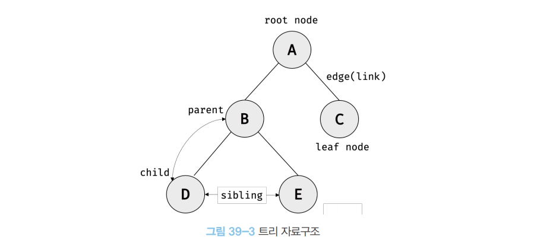
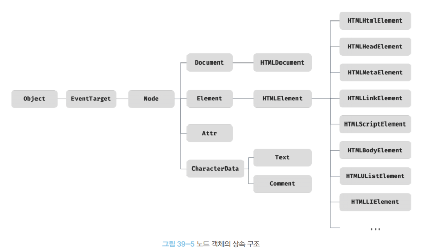
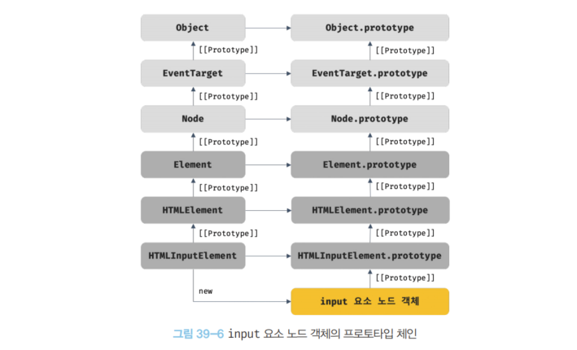
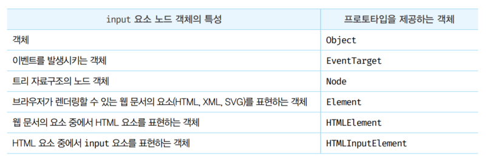
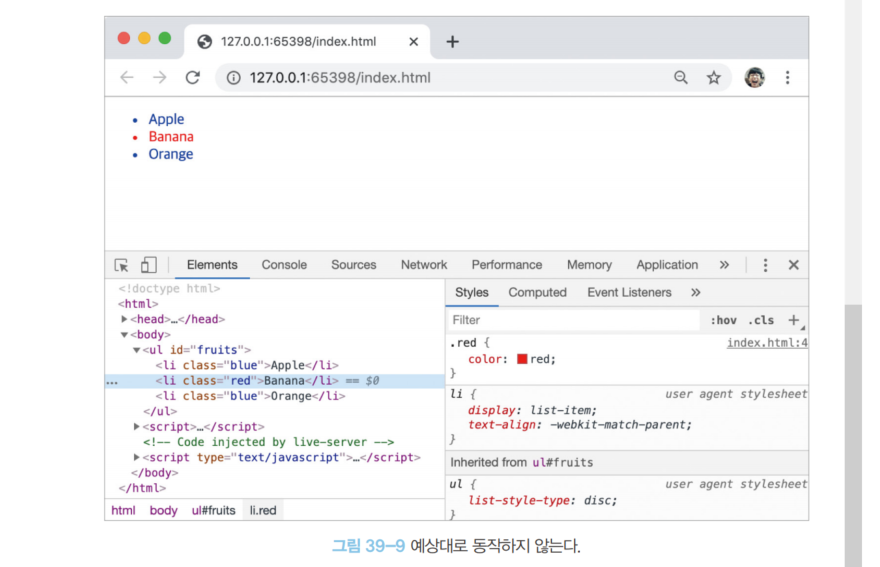

- [39장 DOM](#39장-dom)
  - [📌39.1 NODE(DOM을 구성하는 요소)](#391-nodedom을-구성하는-요소)
    - [✏️39.1.1 HTML 요소와 노드 객체](#️3911-html-요소와-노드-객체)
      - [🎄트리 자료구조](#트리-자료구조)
    - [✏️39.1.2 노드 객체의 타입](#️3912-노드-객체의-타입)
      - [39-01](#39-01)
      - [중요한 노드 타입 4️⃣가지](#중요한-노드-타입-4️⃣가지)
      - [1️⃣문서 노드(document 객체)](#1️⃣문서-노드document-객체)
      - [2️⃣요소 노드](#2️⃣요소-노드)
      - [3️⃣어트리뷰트 노드](#3️⃣어트리뷰트-노드)
      - [4️⃣텍스트노드](#4️⃣텍스트노드)
    - [✏️39.1.3 노드 객체의 상속 구조](#️3913-노드-객체의-상속-구조)
      - [39-02](#39-02)
  - [📌 39.2 요소 노드 취득](#-392-요소-노드-취득)
    - [✏️39.2.1 id를 이용한 요소노드 취득](#️3921-id를-이용한-요소노드-취득)
      - [39-03 getElementById](#39-03-getelementbyid)
      - [39-04 id 값](#39-04-id-값)
      - [39-05 id값을 갖는 HTML 요소가 없을 경우](#39-05-id값을-갖는-html-요소가-없을-경우)
      - [39-06 id값과 동일한 이름의 전역 변수](#39-06-id값과-동일한-이름의-전역-변수)
      - [39-07](#39-07)
  - [📌39.2.2 태그 이름을 이용한 요소 노드 취득](#3922-태그-이름을-이용한-요소-노드-취득)
    - [39-08 getElementsByTagName](#39-08-getelementsbytagname)
    - [39-09 HTML 문서의 모든 요소 노드 취득 방법](#39-09-html-문서의-모든-요소-노드-취득-방법)
    - [39-10](#39-10)
  - [📌 39.2.3 class를 이용한 요소노드 취득](#-3923-class를-이용한-요소노드-취득)
    - [39-11](#39-11)
    - [39-12](#39-12)
  - [📌39.2.4 CSS 선택자를 이용한 요소 노드 취득](#3924-css-선택자를-이용한-요소-노드-취득)
    - [39-13](#39-13)
    - [39-14](#39-14)
    - [39-15 querySelectAll, NodeList](#39-15-queryselectall-nodelist)
    - [39-16](#39-16)
  - [39.2.5 특정 요소 노드를 취득할 수 있는지 확인](#3925-특정-요소-노드를-취득할-수-있는지-확인)
    - [39-17](#39-17)
  - [📌39.2.6 HTMLCollection과 NodeList](#3926-htmlcollection과-nodelist)
    - [✏️HTMLCollection](#️htmlcollection)
      - [39-18 HTMLCollection 객체의 실시간 변경에 대한 주의점](#39-18-htmlcollection-객체의-실시간-변경에-대한-주의점)
      - [39-19 1. 해결 방법: for문을 역방향](#39-19-1-해결-방법-for문을-역방향)
      - [39-20 2. 해결 방법: while문 사용](#39-20-2-해결-방법-while문-사용)
      - [39-21 3. 해결 방법: 유용한 배열의 고차함수사용.](#39-21-3-해결-방법-유용한-배열의-고차함수사용)
    - [✏️NodeList](#️nodelist)
      - [39-22](#39-22)
      - [39-23](#39-23)
      - [39-24 HTMLCollection이나 NodeList 객체 안전하게 사용방법 = 배열로 변환](#39-24-htmlcollection이나-nodelist-객체-안전하게-사용방법--배열로-변환)
- [39-25](#39-25)
- [39-26](#39-26)
- [39-27](#39-27)
- [39-28](#39-28)
- [39-29](#39-29)
- [39-30](#39-30)
- [39-31](#39-31)
- [39-32](#39-32)
- [39-33](#39-33)
- [39-34](#39-34)
- [39-35](#39-35)
- [39-36](#39-36)
- [39-37](#39-37)
- [39-38](#39-38)
- [39-39](#39-39)
- [39-40](#39-40)
- [39-41](#39-41)
- [39-42](#39-42)
- [39-43](#39-43)
- [39-44](#39-44)
- [39-45](#39-45)
- [39-46](#39-46)
- [39-47](#39-47)
- [39-48](#39-48)
- [39-49](#39-49)
- [39-50](#39-50)
- [39-51](#39-51)
- [39-52](#39-52)
- [39-53](#39-53)
- [39-54](#39-54)
- [39-55](#39-55)
- [39-56](#39-56)
- [39-57](#39-57)
- [39-58](#39-58)
- [39-59](#39-59)
- [39-60](#39-60)
- [39-61](#39-61)
- [39-62](#39-62)
- [39-63](#39-63)
- [39-64](#39-64)
- [39-65](#39-65)
- [39-66](#39-66)
- [39-67](#39-67)
- [39-68](#39-68)
- [39-69](#39-69)
- [39-70](#39-70)
- [39-71](#39-71)
- [39-72](#39-72)
- [39-73](#39-73)
- [39-74](#39-74)
- [39-75](#39-75)
- [39-76](#39-76)
- [39-77](#39-77)
- [39-78](#39-78)
- [39-79](#39-79)
- [39-80](#39-80)
- [39-81](#39-81)
- [39-82](#39-82)
- [39-83](#39-83)
- [39-84](#39-84)
- [39-85](#39-85)
- [39-86](#39-86)
- [39-87](#39-87)
- [39-88](#39-88)
- [39-89](#39-89)
- [39-90](#39-90)
- [39-91](#39-91)
- [39-92](#39-92)
- [39-93](#39-93)
- [39-94](#39-94)
- [39-95](#39-95)
- [39-96](#39-96)
- [39-97](#39-97)
- [39-98](#39-98)
- [39-99](#39-99)

# 39장 DOM

- **HTML 문서의 계층 구조**와 **정보를 표현 & 제어 할수 있는 API**
- 프로퍼티와 메서드를 제공하는 트리 자료구조

## 📌39.1 NODE(DOM을 구성하는 요소)

### ✏️39.1.1 HTML 요소와 노드 객체

- **HTML 요소**: HTML문서를 구성하는 개별적인 요소
- HTML 요소 ➡️ 렌더링 엔진에 의해 파싱 ➡️ DOM을 구성하는 요소 노드 객체로 변환
  - HTML요소 어트리뷰트➡️ 어트리뷰트 노드
  - HTML요소 텍스트 콘텐츠 ➡️ 텍스트 노드
    

**HTML문서** : HTML요소들의 집합, 중첩 관계
➡️ HTML요소산에 중첩관계 ➡️ 계층적인 부자관계 형성

- 이 관계를 반영하여 HTML 요소를 객체화한 모든 노드 객체들 -> 트리자료로 구성

#### 🎄트리 자료구조

**트리 자료구조**: 노드들의 계층 구조로 이뤄짐
-> 부모노드와 자식노드로 구성, 노드간의 계층적 구조(비선형 자료구조)

- 하나의 최상위 노드(루트노드)에서 시작, 최상위 노드는 부모노드가 없음
- 루트노드 0개 이상의 자식 노드 가짐.
- \*리프노드 : 자식노드가 없는 노드
  

➡️노드 객체들로 구성된 트리 자료구조 = **DOM**
(노드 객체의 트리라고 **DOM트리** 라고도 부름)

### ✏️39.1.2 노드 객체의 타입

HTML 문서를 파싱🔁 노드 객체

#### 39-01

```html
<!DOCTYPE html>
<html>
  <head>
    <meta charset="UTF-8" />
    <link rel="stylesheet" href="style.css" />
  </head>
  <body>
    <ul>
      <li id="apple">Apple</li>
      <li id="banana">Banana</li>
      <li id="orange">Orange</li>
    </ul>
    <script src="app.js"></script>
  </body>
</html>
```


- 노드객체 종류(12가지)가 있고, 상속구조를 가짐

#### 중요한 노드 타입 4️⃣가지

#### 1️⃣문서 노드(document 객체)

- **문서노드 = 루트 노드(document 객체)**: DOM 트리의 최상위에 존재하는 노드
- document 객체: 브라우저가 랜더링한 HTML 문서 전체를 가리키는 객체 ➡️ window의 document 프로퍼티에 바인딩
- 브라우저 환경의 모든 자바스크립트 코드는 script 태그에 분리되어 있어도 하나의 전역 객체 window를 공유 -> 전역 객체 window의 document프로퍼티에 바인딩 된 하나의 document객체를 바라봄.
- **HTML 문서당 document 객체가 유일**
- **DOM 트리의 노드들에 접근하기 위한 진입점 역할을 담당**(요소, 어트리뷰트, 텍스트 노드에 접근하려면 문서노드를 통해야함.)

\*바인딩(Binding): 프로그램의 어떤 기본 단위가 가질 수 있는 구성요소의 구체적인 값, 성격을 확정하는 것

#### 2️⃣요소 노드

- HTML요소를 가리키는 객체
- 부자 관계를 가지며, 부자관계를 통해 정보를 구조화
- **문서 구조를 표현**

#### 3️⃣어트리뷰트 노드

- HTML 요소의 어트리뷰트를 가리키는 객체
- 부모노드와 연결되어 있지 않고 요소 노드에만 연결
  ➡️ *부모 노드가 없으므로 요소노드의 형제 노드*✖️
- 접근: 어트리뷰트를 참조, 변경 -> 먼저 요소노드에 접근

#### 4️⃣텍스트노드

- HTML요소의 텍스트를 가리키는 객체
- 문서 정보를 표현
- 요소노드의 자식 노드
- 리프노드 : 자식을 가질 수 없는 노드
- DOM 트리의 최종단
- 접근 : 먼저 부모 노드인 요소 노드에 접근

### ✏️39.1.3 노드 객체의 상속 구조

- **DOM:** HTML 문서의 계층적 구조와 정보 표현, 제어할 수 있는 API, 프로퍼티와 메서드를 제공 트리 자료구조
  ➡️ 노드 객체는 자신의 부모, 형제, 자식 탐색 가능, 어트리뷰트와 텍스트 조작 가능

- DOM을 구성하는 노드 객체: 브라우저 환경에서 추가적으로 제공하는 호스트 객체
  - \*호스트 객체: 실행 환경에서 제공하는 객체
- 노드 객체도 자바스크립트 객체이므로 프로토 타입에 의한 상속 구조
  <br/>
  [🎄노드 객체의 상속 구조]
  

- **모든 노드객체**: `Object`, `EventTarget`, `Node` 인터페이스를 상속
  - **문서 노드** :`Document`, `HTMLDocument` 인터페이스 상속받음
  - **어트리뷰트 노드**: `Attr`
  - **텍스트 노드**: `CharacterData` 인터페이스
  - **요소 노드**: `Element`인터페이스



- input요소 파싱 ➡️ 객체화한 input 요소 노드 객체는 HTMLInputElement, HTMLElement, Element, Node, EventTarget, Object의 Prototype에 바인딩 되어 있는 프로토타입 객체를 상속 받음
- input 요소 노드 객체는 프로토타입 체인에 있는 **모든 프로토타입의 프로퍼티나 메서드를 상속받아 사용 가능**

#### 39-02

```html
<!DOCTYPE html>
<html>
  <body>
    <input type="text" />
    <script>
      // input 요소 노드 객체를 선택
      const $input = document.querySelector("input");

      // input 요소 노드 객체의 프로토타입 체인
      console.log(
        Object.getPrototypeOf($input) === HTMLInputElement.prototype,
        Object.getPrototypeOf(HTMLInputElement.prototype) ===
          HTMLElement.prototype,
        Object.getPrototypeOf(HTMLElement.prototype) === Element.prototype,
        Object.getPrototypeOf(Element.prototype) === Node.prototype,
        Object.getPrototypeOf(Node.prototype) === EventTarget.prototype,
        Object.getPrototypeOf(EventTarget.prototype) === Object.prototype
      ); // 모두 true
    </script>
  </body>
</html>
```



<br/>

➡️ 노드 객체의 상속구조는 개발자 도구 Elements 패널 우측의 Properties패널에서 확인할 수 있음.

- 모든 노드객체는 공통으로 갖는 기능이 있음
- 노드 타입에 따라 고유한 기능 있음

  - ex) 이벤트에 관련된 기능(EventTarget.addEventListener 등)은 EventTarget 인터페이스 제공

- 이 같은 노드 관련 기능은 Node 인터페이스 제공

<br/>

- HTML 요소가 객체화된 요소 노드 객체는 HTML요소가 갖는 공통적인 기능이 있음
  -> HTMLElement 인터페이스 제공
  - ex) input요소 노드 객체와 div 요소노드 객체 모두 HTML 요소의 스타일을 나타내는 style 프로퍼티가 있음
- 요소노드 객체는 HTML요소의 종류에 따라 고유한 기능 있음
  <!-- - ex) input 요소 노드 객체 - value 프로퍼티 필요, div요소노드 객체 - value 불필요 -->

  - > ➡️ 필요한 인터페이스(HTMLInputElement, HTMLDivElement 등 ) HTML요소의 종류에 따라 다름.

- 노드 객체는 공통된 기능 - 프로토타입 체인의 상위에
- 개별적인 고유기능 - 프로토타입 체인 하위
  <!-- - >프로토타입 체인을 구축하여 노드 객체에 필요한 기능, 프로퍼티와 메서드를 제공하는 상속 구조 -->

<br/>

- **DOM**

  1. HTML 문서의 계층적 구조와 정보 표현
  2. 노드 타입에 따라 필요한 기능을 프로퍼티와 메서드의 집합인 DOM API를 제공
  3. DOM API를 통해 HTML 구조, 내용, 스타일을 동적으로 조작

  > 💁‍♀️HTML과 DOM 연관지어 바라보기

## 📌 39.2 요소 노드 취득

요소노드 취득: HTML 요소를 조작하는 시작점

### ✏️39.2.1 id를 이용한 요소노드 취득

#### 39-03 getElementById

Document.prototype.getElementById 메서드 : 인수로 전달한 id 어트리뷰트 값을 갖는 요소 노드를 탐색하여 반환.

- 문서노드인 document를 통해 호출

```html
<!DOCTYPE html>
<html>
  <body>
    <ul>
      <li id="apple">Apple</li>
      <li id="banana">Banana</li>
      <li id="orange">Orange</li>
    </ul>
    <script>
      // id 값이 'banana'인 요소 노드를 탐색하여 반환한다.
      // 두 번째 li 요소가 파싱되어 생성된 요소 노드가 반환된다.
      const $elem = document.getElementById("banana");

      // 취득한 요소 노드의 style.color 프로퍼티 값을 변경한다.
      $elem.style.color = "red";
    </script>
  </body>
</html>
```

#### 39-04 id 값

- id 값: HTML문서 내에서 유일한 값
- 여러개 값 가질 수 ✖️
- BUT 중복된 id를 가진 요소가 여러개 존재해도 에러 ✖️
  ➡️ id값을 갖은 첫번째 요소 노드만 반환,
- document.getElementById 메서드: 단 하나의 요소노드를 반환.

```html
<!DOCTYPE html>
<html>
  <body>
    <ul>
      <li id="banana">Apple</li>
      <li id="banana">Banana</li>
      <li id="banana">Orange</li>
    </ul>
    <script>
      // getElementById 메서드는 언제나 단 하나의 요소 노드를 반환한다.
      // 첫 번째 li 요소가 파싱되어 생성된 요소 노드가 반환된다.
      const $elem = document.getElementById("banana");

      // 취득한 요소 노드의 style.color 프로퍼티 값을 변경한다.
      $elem.style.color = "red";
    </script>
  </body>
</html>
```

#### 39-05 id값을 갖는 HTML 요소가 없을 경우

- id값을 갖는 HTML 요소가 없을 경우 -> null 반환

```html
<!DOCTYPE html>
<html>
  <body>
    <ul>
      <li id="apple">Apple</li>
      <li id="banana">Banana</li>
      <li id="orange">Orange</li>
    </ul>
    <script>
      // id 값이 'grape'인 요소 노드를 탐색하여 반환한다. null이 반환된다.
      const $elem = document.getElementById("grape");

      // 취득한 요소 노드의 style.color 프로퍼티 값을 변경한다.
      $elem.style.color = "red";
      // -> TypeError: Cannot read property 'style' of null
    </script>
  </body>
</html>
```

#### 39-06 id값과 동일한 이름의 전역 변수

- HTML 요소에 id 어트리뷰트를 부여 ➡️ id값과 동일한 이름의 전역 변수가 암묵적으로 선언된다.

```html
<!DOCTYPE html>
<html>
  <body>
    <div id="foo"></div>
    <script>
      // id 값과 동일한 이름의 전역 변수가 암묵적으로 선언되고 해당 노드 객체가 할당된다.
      console.log(foo === document.getElementById("foo")); // true

      // 암묵적 전역으로 생성된 전역 프로퍼티는 삭제되지만 전역 변수는 삭제되지 않는다.
      delete foo;
      console.log(foo); // <div id="foo"></div>
    </script>
  </body>
</html>
```

#### 39-07

- BUT. id 값과 동일한 이름의 전역 변수가 이미 있으면 ➡️ 전역 변수에 노드 객체가 재할당 안됨✖️

```html
<!DOCTYPE html>
<html>
  <body>
    <div id="foo"></div>
    <script>
      //전역 변수 선언
      let foo = 1;

      // id 값과 동일한 이름의 전역 변수가 이미 선언되어 있으면 노드 객체가 재할당되지 않는다.
      console.log(foo); // 1
    </script>
  </body>
</html>
```

## 📌39.2.2 태그 이름을 이용한 요소 노드 취득

#### 39-08 getElementsByTagName

- `Document.prototype/Element.prototype.getElementsByTagName` 메서드
  - 인수로 전달한 태그 이름을 갖는 모든 요소 노드들을 반환
  - 여러개 요소 노드 객체를 갖는 DOM 컬렉션 객체인 `HTMLCollection` 객체를 반환

```html
<!DOCTYPE html>
<html>
  <body>
    <ul>
      <li id="apple">Apple</li>
      <li id="banana">Banana</li>
      <li id="orange">Orange</li>
    </ul>
    <script>
      // 태그 이름이 li인 요소 노드를 모두 탐색하여 반환한다.
      // 탐색된 요소 노드들은 HTMLCollection 객체에 담겨 반환된다.
      // HTMLCollection 객체는 유사 배열 객체이면서 이터러블이다.
      const $elems = document.getElementsByTagName("li");

      // 취득한 모든 요소 노드의 style.color 프로퍼티 값을 변경한다.
      // HTMLCollection 객체를 배열로 변환하여 순회하며 color 프로퍼티 값을 변경한다.
      [...$elems].forEach((elem) => {
        elem.style.color = "red";
      });
    </script>
  </body>
</html>
```

- 함수는 하나의 값만 반환
  - 여러개 값 반환하려면 배열이나 객체와 같은 자료구조에 감아 반환
  - ➡️DOM 컬렉션 객체인 `HTMLCollection` 객체 = 유사배열 객체 && 이터러블(반복 가능한 객체)


#### 39-09 HTML 문서의 모든 요소 노드 취득 방법

- HTML 문서의 모든 요소 노드 취득 방법: getElementsByTagName 메서드의 인수로 ' \* ' 을 전달

```javascript
// 모든 요소 노드를 탐색하여 반환한다.
const $all = document.getElementsByTagName("*");
// -> HTMLCollection(8) [html, head, body, ul, li#apple, li#banana, li#orange, script, apple: li#apple, banana: li#banana, orange: li#orange]
```

#### 39-10

- getElementsByTagName 메서드
  1. Document.prototype에 정의된 메서드
  2. Element.prototype에 정의된 메서드

1. `Document.prototype.getElementsByTagName`: DOM 전체에서 요소 노드를 탐색하여 반환.
2. `Element.prototype.getElementsByTagName`: 특정 요소 노드 호출, 특정 요소 노드의 자손 노드 중에서 요소 노드를 탐색, 반환

```html
<!DOCTYPE html>
<html>
  <body>
    <ul id="fruits">
      <li>Apple</li>
      <li>Banana</li>
      <li>Orange</li>
    </ul>
    <ul>
      <li>HTML</li>
    </ul>
    <script>
      // DOM 전체에서 태그 이름이 li인 요소 노드를 모두 탐색하여 반환한다.
      const $lisFromDocument = document.getElementsByTagName("li");
      console.log($lisFromDocument); // HTMLCollection(4) [li, li, li, li]

      // #fruits 요소의 자손 노드 중에서 태그 이름이 li인 요소 노드를 모두
      // 탐색하여 반환한다.
      const $fruits = document.getElementById("fruits");
      const $lisFromFruits = ✨$fruits.getElementsByTagName("li");
      console.log($lisFromFruits); // HTMLCollection(3) [li, li, li]
    </script>
  </body>
</html>
```

- 인수로 전달된 태그 이름을 갖는 요소가 없으면, getElementsByTagName 메서드는 ➡️ 빈 HTMLCollection객체 반환.

## 📌 39.2.3 class를 이용한 요소노드 취득

- Document.prototype/Element.prototype.**getClassByTagName** 메서드는 인수로 전달한 class 어트리뷰트 값을 갖는 모든 요소 노드들을 탐색, 반환
- class값 공백 구분해서 여러개 사용가능
- 여러개의 요소 노드 객체를 갖는 `HTMLCollection`객체를 반환

#### 39-11

```html
<!DOCTYPE html>
<html>
  <body>
    <ul>
      <li class="fruit apple">Apple</li>
      <li class="fruit banana">Banana</li>
      <li class="fruit orange">Orange</li>
    </ul>
    <script>
      // class 값이 'fruit'인 요소 노드를 모두 탐색하여 HTMLCollection 객체에 담아 반환한다.
      const $elems = document.getElementsByClassName("fruit");

      // 취득한 모든 요소의 CSS color 프로퍼티 값을 변경한다.
      [...$elems].forEach((elem) => {
        elem.style.color = "red";
      });

      // class 값이 'fruit apple'인 요소 노드를 모두 탐색하여 HTMLCollection 객체에 담아 반환한다.
      const $apples = document.getElementsByClassName("fruit apple");

      // 취득한 모든 요소 노드의 style.color 프로퍼티 값을 변경한다.
      [...$apples].forEach((elem) => {
        elem.style.color = "blue";
      });
    </script>
  </body>
</html>
```

#### 39-12

1. `Document.prototype.getElementsByClassName`: DOM 전체에서 요소 노드를 탐색, 반환
2. `Element.prototype.getElementsByClassName`: 특정요소 노드를 통해 호출, 특정 요소노드의 자손 노드 중에서 요소 노드를 탐색, 반환

```html
<!DOCTYPE html>
<html>
  <body>
    <ul id="fruits">
      <li class="apple">Apple</li>
      <li class="banana">Banana</li>
      <li class="orange">Orange</li>
    </ul>
    <div class="banana">Banana</div>
    <script>
      // DOM 전체에서 class 값이 'banana'인 요소 노드를 모두 탐색하여 반환한다.
      const $bananasFromDocument = document.getElementsByClassName("banana");
      console.log($bananasFromDocument); // HTMLCollection(2) [li.banana, div.banana]

      // #fruits 요소의 자손 노드 중에서 class 값이 'banana'인 요소 노드를 모두 탐색하여 반환한다.
      const $fruits = document.getElementById("fruits");
      const $bananasFromFruits = $fruits.getElementsByClassName("banana");

      console.log($bananasFromFruits); // HTMLCollection [li.banana]
    </script>
  </body>
</html>
```

- class 값을 갖는 요소가 존재 하지 않는 경우, 빈 HTMLCollection 객체 반환.

## 📌39.2.4 CSS 선택자를 이용한 요소 노드 취득

- CSS 선택자: 스타일을 적용하고자 하는 HTML 요소를 특정할 때

#### 39-13

```css
/* 전체 선택자: 모든 요소를 선택 */
* {
  ...;
}
/* 태그 선택자: 모든 p 태그 요소를 모두 선택 */
p {
  ...;
}
/* id 선택자: id 값이 'foo'인 요소를 모두 선택 */
#foo {
  ...;
}
/* class 선택자: class 값이 'foo'인 요소를 모두 선택 */
.foo {
  ...;
}
/* 어트리뷰트 선택자: input 요소 중에 type 어트리뷰트 값이 'text'인 요소를 모두 선택 */
input[type="text"] {
  ...;
}
/* 후손 선택자: div 요소의 후손 요소 중 p 요소를 모두 선택 */
div p {
  ...;
}
/* 자식 선택자: div 요소의 자식 요소 중 p 요소를 모두 선택 */
div > p {
  ...;
}
/* 인접 형제 선택자: p 요소의 형제 요소 중에 p 요소 바로 뒤에 위치하는 ul 요소를 선택 */
p + ul {
  ...;
}
/* 일반 형제 선택자: p 요소의 형제 요소 중에 p 요소 뒤에 위치하는 ul 요소를 모두 선택 */
p ~ ul {
  ...;
}
/* 가상 클래스 선택자: hover 상태인 a 요소를 모두 선택 */
a:hover {
  ...;
}
/* 가상 요소 선택자: p 요소의 콘텐츠의 앞에 위치하는 공간을 선택
   일반적으로 content 프로퍼티와 함께 사용된다. */
p::before {
  ...;
}
```

#### 39-14

- `Document.prototype/Element.prototype.querySelector` 메소드: 인수로 전달한 CSS 선택자를 만족시키는 하나의 요소 노드 반환
  - CSS 선택자를 만족시키는 요소도느가 여러개: 첫번째 요소 노드만 반환
  - 만족시키는 요소노드가 ✖️: null 반환
  - 전달한 CSS 선택자가 문법에 맞지 않는 경우: DOMException 에러가 발생한다.

```html
<!DOCTYPE html>
<html>
  <body>
    <ul>
      <li class="apple">Apple</li>
      <li class="banana">Banana</li>
      <li class="orange">Orange</li>
    </ul>
    <script>
      // class 어트리뷰트 값이 'banana'인 첫 번째 요소 노드를 탐색하여 반환한다.
      const $elem = document.querySelector(".banana");

      // 취득한 요소 노드의 style.color 프로퍼티 값을 변경한다.
      $elem.style.color = "red";
    </script>
  </body>
</html>
```

<div class="result"></div>

#### 39-15 querySelectAll, NodeList

- **querySelectAll 메서드 :** 여러 개의 요소 노드 객체를 갖는 DOM 컬렉션 객체인 NodeList 객체를 반환.
- **NodeList 객체 :** 유사 배열 객체 && 이터러블

```html
<!DOCTYPE html>
<html>
  <body>
    <ul>
      <li class="apple">Apple</li>
      <li class="banana">Banana</li>
      <li class="orange">Orange</li>
    </ul>
    <script>
      // ul 요소의 자식 요소인 li 요소를 모두 탐색하여 반환한다.
      const $elems = document.querySelectorAll("ul > li");
      // 취득한 요소 노드들은 NodeList 객체에 담겨 반환된다.
      console.log($elems); // NodeList(3) [li.apple, li.banana, li.orange]

      // 취득한 모든 요소 노드의 style.color 프로퍼티 값을 변경한다.
      // NodeList는 forEach 메서드를 제공한다.
      $elems.forEach((elem) => {
        elem.style.color = "red";
      });
    </script>
  </body>
</html>
```

#### 39-16

- HTML 문서의 모든 요소 노드를 취득 방법 : querySelectorAll 메서드의 인수를 전체 선택자 ' \* '를 전달

```javascript
// 모든 요소 노드를 탐색하여 반환한다.
const $all = document.querySelectorAll("*");
// -> NodeList(8) [html, head, body, ul, li#apple, li#banana, li#orange, script]
```

**querySelector, querySelectorAll 메서드**
(getElementsByTag)

1. `Document.prototype`: DOM 전체에서 요소 노드를 탐색, 반환
2. `Element.prototype`: 특정요소 노드를 통해 호출, 특정 요소노드의 자손 노드 중에서 요소 노드를 탐색, 반환

- querySelector, querySelectorAll 메서드는 getElementById, getElementsBy\*\*\* 메서드보다 느리다⬇️
  - ➡️ **BUT.** CSS 선택자 문법을 사용하여 좀 더 구체적인 조건으로 요소 노드를 취득할 수 있다는 장점이 있다.
    <br/>

> **[🤔getElementById,querySelector,querySelectorAll 셋중에 뭐 사용해야해?]**
>
> 1.  id 어트리뷰트가 있는 요소 노드를 취득하는 경우, `getElementById` 메서드를 사용!
> 2.  이 외에는 `querySelector`, `querySelectorAll` 사용 권장!

## 39.2.5 특정 요소 노드를 취득할 수 있는지 확인

- Element.prototype.matches 메서드 : 인수로 전달한 CSS 선택자를 통해 특정 요소 노드 취득할 수 있는지 확인(true, false)

- Element.prototype.matches: 이벤트 위임 사용에 유용

#### 39-17

```html
<!DOCTYPE html>
<html>
  <body>
    <ul id="fruits">
      <li class="apple">Apple</li>
      <li class="banana">Banana</li>
      <li class="orange">Orange</li>
    </ul>
  </body>
  <script>
    const $apple = document.querySelector(".apple");

    // $apple 노드는 '#fruits > li.apple'로 취득할 수 있다.
    console.log($apple.matches("#fruits > li.apple")); // true

    // $apple 노드는 '#fruits > li.banana'로 취득할 수 없다.
    console.log($apple.matches("#fruits > li.banana")); // false
  </script>
</html>
```

## 📌39.2.6 HTMLCollection과 NodeList

- HTMLCollection, NodeList
  - DOM API가 여러개의 결과값을 반환하기 위한 **DOM 컬렉션 객체**
  - 유사 배열 객체, 이터러블 ➡️ for..of문으로 순회 가능, 스프레드 문법으로 간단히 배열로 변환 가능
  - ✨노드 객체의 상태 변화를 실시간으로 반영하는 **살아있는 객체**

> [`HTMLCollection`과 `NodeList` 차이점]
>
> - `HTMLCollection`: 언제나 live 객체로 동작
> - `NodeList`: 상태변화를 실시간으로 반영하지 않고, 과거의 정적 상태를 유지하는 non-live 객체로 동작, 경우에 따라 live로 동작할 때가 있다.

### ✏️HTMLCollection

- `HTMLCollection 객체` : 노드 객체의 상태 변화를 실시간으로 반영하는 살아있는 DOM 컬렉션 객체(살아 있는 객체)
- getElementsByTagName, getElementsByClassName 메서드가 반환

#### 39-18 HTMLCollection 객체의 실시간 변경에 대한 주의점

```html
<!DOCTYPE html>
<head>
  <style>
    .red {
      color: red;
    }
    .blue {
      color: blue;
    }
  </style>
</head>
<html>
  <body>
    <ul id="fruits">
      <li class="red">Apple</li>
      <li class="red">Banana</li>
      <li class="red">Orange</li>
    </ul>
    <script>
      // class 값이 'red'인 요소 노드를 모두 탐색하여 HTMLCollection 객체에 담아 반환한다.
      const $elems = document.getElementsByClassName("red");
      // 이 시점에 HTMLCollection 객체에는 3개의 요소 노드가 담겨 있다.
      console.log($elems); // HTMLCollection(3) [li.red, li.red, li.red]

      // HTMLCollection 객체의 모든 요소의 class 값을 'blue'로 변경한다.
      for (let i = 0; i < $elems.length; i++) {
        $elems[i].className = "blue";
      }

      // HTMLCollection 객체의 요소가 3개에서 1개로 변경되었다.
      console.log($elems); // HTMLCollection(1) [li.red]
    </script>
  </body>
</html>
```

- class 값이 'red'인 요소 노드를 모두 취득하고 모든 요소의 class값을 'red' -> 'blue'로 변경
- 🤔BUT. 두번째 li요소만 class값이 변경되지 않는다.



[🤔예상대로 작동하지 않은 이유]

1. 첫번째 반복
   - `$elems[0]`은 첫번째 `li`요소. class값이 변경됨. 더이상 'red'와 일치하지 않기때문에 `$elems`에서 실시간 제거. (➡️ `HTMLCollection`객체는 살아있는 `DOM` 컬켁션 객체.)
2. 두번째 반복
   - `$elems[1]`은 세번째 li요소. 실시간으로 제외
3. 세번째 반복
   - `$elems[2]`은 두번째 li요소. `$elems`에 두번째 `li` 요소 노드만 남음. 이때 $elems.length는 1이므로 for문 조건식 i < $elems.length가 false로 평가되어 반복이 종료된다. 따라서 $elems에 남아있는 두번째 li요소의 class값은 변경되지 않는다.

- ⚠️이처럼 HTMLCollection 객체는 실시간으로 노드 객체의 상태 변경을 반영하여 요소 삭제 ➡️ for문으로 순회하면서 노드 객체의 상태를 변경할때 주의!!

#### 39-19 1. 해결 방법: for문을 역방향

➡️ 1. 문제 해결 방법: for문을 역방향으로 순회하는 방법

```javascript
// for 문을 역방향으로 순회
for (let i = $elems.length - 1; i >= 0; i--) {
  $elems[i].className = "blue";
}
```

#### 39-20 2. 해결 방법: while문 사용

➡️ 2. 문제 해결 방법: while문 사용, 노드객체가 남아 있지 않을 때까지 무한 반복 방법

```javascript
// while 문으로 HTMLCollection에 요소가 남아 있지 않을 때까지 무한 반복
let i = 0;
while ($elems.length > i) {
  $elems[i].className = "blue";
}
```

#### 39-21 3. 해결 방법: 유용한 배열의 고차함수사용.

➡️ 3. ✨문제 해결 방법: 부작용을 발생시키는 HTMLCollection객체를 사용하지 않는 것.

- 💁‍♀️**유용한 배열의 고차함수(forEach, map, filter,reduce 등) 사용.**

```javascript
// 유사 배열 객체이면서 이터러블인 HTMLCollection을 배열로 변환하여 순회
[...$elems].forEach((elem) => (elem.className = "blue"));
```

### ✏️NodeList

- `HTMLCollection` 객체의 부작용을 해결하기 위해 `querySelectorAll` 메서드를 사용하는 방법이 있음.
- `querySelectorAll` 메서드는 DOM 컬렉션 객체인 NodeList 객체를 반환한다.

- **NodeList 객체**: 노드 객체의 상태 변경을 반영하지 않는 객체

#### 39-22

```javascript
// querySelectorAll은 DOM 컬렉션 객체인 NodeList를 반환한다.
const $elems = document.querySelectorAll(".red");

// 💁‍♀️NodeList 객체는 NodeList.prototype.forEach 메서드를 상속받아 사용할 수 있다.
$elems.forEach((elem) => (elem.className = "blue"));
```

#### 39-23

- **NodeList 객체**
  - `NodeList.prototype.forEach` 메서드를 상속받아 사용가능.
  - `NodeList.prototype`은 `item, entries, keys, values` 메서드를 제공.
  - 대부분 경우 노드 객체의 상태 변경을 실시간으로 반영하지 않고, 과거의 정적 상태를 유지하는 non-live 객체로 동작.
    > - BUT. ⚠️`childNodes` 프로퍼티가 반환하는 `NodeList` 객체는 `HTMLCollection` 객체와 같이 실시간으로 노드 객체의 상태 변경을 반영하는 live 객체로 동작하므로 주의가 필요하다.

```html
<!DOCTYPE html>
<html>
  <body>
    <ul id="fruits">
      <li>Apple</li>
      <li>Banana</li>
    </ul>
  </body>
  <script>
    const $fruits = document.getElementById("fruits");

    // childNodes 프로퍼티는 NodeList 객체(live)를 반환한다.
    const { childNodes } = $fruits;
    console.log(childNodes instanceof NodeList); // true

    // $fruits 요소의 자식 노드는 공백 텍스트 노드(39.3.1절 "공백 텍스트 노드" 참고)를 포함해 모두 5개다.
    console.log(childNodes); // NodeList(5) [text, li, text, li, text]

    for (let i = 0; i < childNodes.length; i++) {
      // removeChild 메서드는 $fruits 요소의 자식 노드를 DOM에서 삭제한다.
      // (39.6.9절 "노드 삭제" 참고)
      // removeChild 메서드가 호출될 때마다 NodeList 객체인 childNodes가 실시간으로 변경된다.
      // 따라서 첫 번째, 세 번째 다섯 번째 요소만 삭제된다.
      $fruits.removeChild(childNodes[i]);
    }

    // 예상과 다르게 $fruits 요소의 모든 자식 노드가 삭제되지 않는다.
    console.log(childNodes); // NodeList(2) [li, li]
  </script>
</html>
```

#### 39-24 HTMLCollection이나 NodeList 객체 안전하게 사용방법 = 배열로 변환

- 이처럼 `HTMLCollection`이나 `NodeList 객체`는 ⚠️예상과 다르게 동작할 때가 있어 다루기 까다롭고 실수하기 쉽다.
- ➡️ 노드 객체의 상태 변경과 상관없이 안전하게 DOM 컬렉션을 사용하려면 => ✨**HTMLCollection이나 NodeList객체를 배열로 변환하여 사용**
- 배열로 변환하면 유용한 고차 함수(forEach, map, filter, reduce 등)를 사용할 수 있다.
- HTMLCollection과 NodeList 객체는 모두 유사 배열 객체이면서 이터러블 ➡️ 스프레드 문법 or Array.from 메서드를 사용하여 간단히 배열로 변환

```html
<!DOCTYPE html>
<html>
  <body>
    <ul id="fruits">
      <li>Apple</li>
      <li>Banana</li>
    </ul>
  </body>
  <script>
    const $fruits = document.getElementById("fruits");

    // childNodes 프로퍼티는 NodeList 객체(live)를 반환한다.
    const { childNodes } = $fruits;

    // 스프레드 문법을 사용하여 NodeList 객체를 배열로 변환한다.
    [...childNodes].forEach((childNode) => {
      $fruits.removeChild(childNode);
    });

    // $fruits 요소의 모든 자식 노드가 모두 삭제되었다.
    console.log(childNodes); // NodeList []
  </script>
</html>
```

---

# 39-25

```html
<ul id="fruits">
  <li class="apple">Apple</li>
  <li class="banana">Banana</li>
  <li class="orange">Orange</li>
</ul>
```

# 39-26

```html
<!DOCTYPE html>
<html>
  <body>
    <ul id="fruits">
      <li class="apple">Apple</li>
      <li class="banana">Banana</li>
      <li class="orange">Orange</li>
    </ul>
  </body>
</html>
```

# 39-27

```html
<ul id="fruits">
  <li class="apple">Apple</li>
  <li class="banana">Banana</li>
  <li class="orange">Orange</li>
</ul>
```

# 39-28

```html
<!DOCTYPE html>
<html>
  <body>
    <ul id="fruits">
      <li class="apple">Apple</li>
      <li class="banana">Banana</li>
      <li class="orange">Orange</li>
    </ul>
  </body>
  <script>
    // 노드 탐색의 기점이 되는 #fruits 요소 노드를 취득한다.
    const $fruits = document.getElementById("fruits");

    // #fruits 요소의 모든 자식 노드를 탐색한다.
    // childNodes 프로퍼티가 반환한 NodeList에는 요소 노드뿐만 아니라 텍스트 노드도 포함되어 있다.
    console.log($fruits.childNodes);
    // NodeList(7) [text, li.apple, text, li.banana, text, li.orange, text]

    // #fruits 요소의 모든 자식 노드를 탐색한다.
    // children 프로퍼티가 반환한 HTMLCollection에는 요소 노드만 포함되어 있다.
    console.log($fruits.children);
    // HTMLCollection(3) [li.apple, li.banana, li.orange]

    // #fruits 요소의 첫 번째 자식 노드를 탐색한다.
    // firstChild 프로퍼티는 텍스트 노드를 반환할 수도 있다.
    console.log($fruits.firstChild); // #text

    // #fruits 요소의 마지막 자식 노드를 탐색한다.
    // lastChild 프로퍼티는 텍스트 노드를 반환할 수도 있다.
    console.log($fruits.lastChild); // #text

    // #fruits 요소의 첫 번째 자식 노드를 탐색한다.
    // firstElementChild 프로퍼티는 요소 노드만 반환한다.
    console.log($fruits.firstElementChild); // li.apple

    // #fruits 요소의 마지막 자식 노드를 탐색한다.
    // lastElementChild 프로퍼티는 요소 노드만 반환한다.
    console.log($fruits.lastElementChild); // li.orange
  </script>
</html>
```

# 39-29

```html
<!DOCTYPE html>
<html>
  <body>
    <ul id="fruits"></ul>
  </body>
  <script>
    // 노드 탐색의 기점이 되는 #fruits 요소 노드를 취득한다.
    const $fruits = document.getElementById("fruits");

    // #fruits 요소에 자식 노드가 존재하는지 확인한다.
    // hasChildNodes 메서드는 텍스트 노드를 포함하여 자식 노드의 존재를 확인한다.
    console.log($fruits.hasChildNodes()); // true
  </script>
</html>
```

# 39-30

```html
<!DOCTYPE html>
<html>
  <body>
    <ul id="fruits"></ul>
  </body>
  <script>
    // 노드 탐색의 기점이 되는 #fruits 요소 노드를 취득한다.
    const $fruits = document.getElementById("fruits");

    // hasChildNodes 메서드는 텍스트 노드를 포함하여 자식 노드의 존재를 확인한다.
    console.log($fruits.hasChildNodes()); // true

    // 자식 노드 중에 텍스트 노드가 아닌 요소 노드가 존재하는지는 확인한다.
    console.log(!!$fruits.children.length); // 0 -> false
    // 자식 노드 중에 텍스트 노드가 아닌 요소 노드가 존재하는지는 확인한다.
    console.log(!!$fruits.childElementCount); // 0 -> false
  </script>
</html>
```

# 39-31

```html
<!DOCTYPE html>
<html>
  <body>
    <div id="foo">Hello</div>
    <script>
      // 요소 노드의 텍스트 노드는 firstChild 프로퍼티로 접근할 수 있다.
      console.log(document.getElementById("foo").firstChild); // #text
    </script>
  </body>
</html>
```

# 39-32

```html
<!DOCTYPE html>
<html>
  <body>
    <ul id="fruits">
      <li class="apple">Apple</li>
      <li class="banana">Banana</li>
      <li class="orange">Orange</li>
    </ul>
  </body>
  <script>
    // 노드 탐색의 기점이 되는 .banana 요소 노드를 취득한다.
    const $banana = document.querySelector(".banana");

    // .banana 요소 노드의 부모 노드를 탐색한다.
    console.log($banana.parentNode); // ul#fruits
  </script>
</html>
```

# 39-33

```html
<!DOCTYPE html>
<html>
  <body>
    <ul id="fruits">
      <li class="apple">Apple</li>
      <li class="banana">Banana</li>
      <li class="orange">Orange</li>
    </ul>
  </body>
  <script>
    // 노드 탐색의 기점이 되는 #fruits 요소 노드를 취득한다.
    const $fruits = document.getElementById("fruits");

    // #fruits 요소의 첫 번째 자식 노드를 탐색한다.
    // firstChild 프로퍼티는 요소 노드뿐만 아니라 텍스트 노드를 반환할 수도 있다.
    const { firstChild } = $fruits;
    console.log(firstChild); // #text

    // #fruits 요소의 첫 번째 자식 노드(텍스트 노드)의 다음 형제 노드를 탐색한다.
    // nextSibling 프로퍼티는 요소 노드뿐만 아니라 텍스트 노드를 반환할 수도 있다.
    const { nextSibling } = firstChild;
    console.log(nextSibling); // li.apple

    // li.apple 요소의 이전 형제 노드를 탐색한다.
    // previousSibling 프로퍼티는 요소 노드뿐만 아니라 텍스트 노드를 반환할 수도 있다.
    const { previousSibling } = nextSibling;
    console.log(previousSibling); // #text

    // #fruits 요소의 첫 번째 자식 요소 노드를 탐색한다.
    // firstElementChild 프로퍼티는 요소 노드만 반환한다.
    const { firstElementChild } = $fruits;
    console.log(firstElementChild); // li.apple

    // #fruits 요소의 첫 번째 자식 요소 노드(li.apple)의 다음 형제 노드를 탐색한다.
    // nextElementSibling 프로퍼티는 요소 노드만 반환한다.
    const { nextElementSibling } = firstElementChild;
    console.log(nextElementSibling); // li.banana

    // li.banana 요소의 이전 형제 요소 노드를 탐색한다.
    // previousElementSibling 프로퍼티는 요소 노드만 반환한다.
    const { previousElementSibling } = nextElementSibling;
    console.log(previousElementSibling); // li.apple
  </script>
</html>
```

# 39-34

```html
<!DOCTYPE html>
<html>
  <body>
    <div id="foo">Hello</div>
  </body>
  <script>
    // 문서 노드의 노드 정보를 취득한다.
    console.log(document.nodeType); // 9
    console.log(document.nodeName); // #document

    // 요소 노드의 노드 정보를 취득한다.
    const $foo = document.getElementById("foo");
    console.log($foo.nodeType); // 1
    console.log($foo.nodeName); // DIV

    // 텍스트 노드의 노드 정보를 취득한다.
    const $textNode = $foo.firstChild;
    console.log($textNode.nodeType); // 3
    console.log($textNode.nodeName); // #text
  </script>
</html>
```

# 39-35

```html
<!DOCTYPE html>
<html>
  <body>
    <div id="foo">Hello</div>
  </body>
  <script>
    // 문서 노드의 nodeValue 프로퍼티를 참조한다.
    console.log(document.nodeValue); // null

    // 요소 노드의 nodeValue 프로퍼티를 참조한다.
    const $foo = document.getElementById("foo");
    console.log($foo.nodeValue); // null

    // 텍스트 노드의 nodeValue 프로퍼티를 참조한다.
    const $textNode = $foo.firstChild;
    console.log($textNode.nodeValue); // Hello
  </script>
</html>
```

# 39-36

```html
<!DOCTYPE html>
<html>
  <body>
    <div id="foo">Hello</div>
  </body>
  <script>
    // 1. #foo 요소 노드의 자식 노드인 텍스트 노드를 취득한다.
    const $textNode = document.getElementById("foo").firstChild;

    // 2. nodeValue 프로퍼티를 사용하여 텍스트 노드의 값을 변경한다.
    $textNode.nodeValue = "World";

    console.log($textNode.nodeValue); // World
  </script>
</html>
```

<div class="result"></div>

# 39-37

```html
<!DOCTYPE html>
<html>
  <body>
    <div id="foo">Hello <span>world!</span></div>
  </body>
  <script>
    // #foo 요소 노드의 텍스트를 모두 취득한다. 이때 HTML 마크업은 무시된다.
    console.log(document.getElementById("foo").textContent); // Hello world!
  </script>
</html>
```

# 39-38

```html
<!DOCTYPE html>
<html>
  <body>
    <div id="foo">Hello <span>world!</span></div>
  </body>
  <script>
    // #foo 요소 노드는 텍스트 노드가 아니다.
    console.log(document.getElementById("foo").nodeValue); // null
    // #foo 요소 노드의 자식 노드인 텍스트 노드의 값을 취득한다.
    console.log(document.getElementById("foo").firstChild.nodeValue); // Hello
    // span 요소 노드의 자식 노드인 텍스트 노드의 값을 취득한다.
    console.log(document.getElementById("foo").lastChild.firstChild.nodeValue); // world!
  </script>
</html>
```

# 39-39

```html
<!DOCTYPE html>
<html>
  <body>
    <!-- 요소 노드의 콘텐츠 영역에 다른 요소 노드가 없고 텍스트만 존재 -->
    <div id="foo">Hello</div>
  </body>
  <script>
    const $foo = document.getElementById("foo");

    // 요소 노드의 콘텐츠 영역에 자식 요소 노드가 없고 텍스트만 존재한다면
    // firstChild.nodeValue와 textContent는 같은 결과를 반환한다.
    console.log($foo.textContent === $foo.firstChild.nodeValue); // true
  </script>
</html>
```

# 39-40

```html
<!DOCTYPE html>
<html>
  <body>
    <div id="foo">Hello <span>world!</span></div>
  </body>
  <script>
    // #foo 요소 노드의 모든 자식 노드가 제거되고 할당한 문자열이 텍스트로 추가된다.
    // 이때 HTML 마크업이 파싱되지 않는다.
    document.getElementById("foo").textContent = "Hi <span>there!</span>";
  </script>
</html>
```

# 39-41

```html
<!DOCTYPE html>
<html>
  <body>
    <div id="foo">Hello <span>world!</span></div>
  </body>
  <script>
    // #foo 요소의 콘텐츠 영역 내의 HTML 마크업을 문자열로 취득한다.
    console.log(document.getElementById("foo").innerHTML);
    // "Hello <span>world!</span>"
  </script>
</html>
```

# 39-42

```html
<!DOCTYPE html>
<html>
  <body>
    <div id="foo">Hello <span>world!</span></div>
  </body>
  <script>
    // HTML 마크업이 파싱되어 요소 노드의 자식 노드로 DOM에 반영된다.
    document.getElementById("foo").innerHTML = "Hi <span>there!</span>";
  </script>
</html>
```

# 39-43

```html
<!DOCTYPE html>
<html>
  <body>
    <ul id="fruits">
      <li class="apple">Apple</li>
    </ul>
  </body>
  <script>
    const $fruits = document.getElementById("fruits");

    // 노드 추가
    $fruits.innerHTML += '<li class="banana">Banana</li>';

    // 노드 교체
    $fruits.innerHTML = '<li class="orange">Orange</li>';

    // 노드 삭제
    $fruits.innerHTML = "";
  </script>
</html>
```

# 39-44

```html
<!DOCTYPE html>
<html>
  <body>
    <div id="foo">Hello</div>
  </body>
  <script>
    // innerHTML 프로퍼티로 스크립트 태그를 삽입하여 자바스크립트가 실행되도록 한다.
    // HTML5는 innerHTML 프로퍼티로 삽입된 script 요소 내의 자바스크립트 코드를 실행하지 않는다.
    document.getElementById('foo').innerHTML
      = '<script>alert(document.cookie)</script>';
  </script>
</html>
```

# 39-45

```html
<!DOCTYPE html>
<html>
  <body>
    <div id="foo">Hello</div>
  </body>
  <script>
    // 에러 이벤트를 강제로 발생시켜서 자바스크립트 코드가 실행되도록 한다.
    document.getElementById(
      "foo"
    ).innerHTML = ``;
  </script>
</html>
```

# 39-46

```html
<!DOCTYPE html>
<html>
  <body>
    <ul id="fruits">
      <li class="apple">Apple</li>
    </ul>
  </body>
  <script>
    const $fruits = document.getElementById("fruits");

    // 노드 추가
    $fruits.innerHTML += '<li class="banana">Banana</li>';
  </script>
</html>
```

<div class="result"></div>

# 39-47

```javascript
$fruits.innerHTML += '<li class="banana">Banana</li>';
```

# 39-48

```javascript
$fruits.innerHTML = $fruits.innerHTML + '<li class="banana">Banana</li>';
// '<li class="apple">Apple</li>' + '<li class="banana">Banana</li>'
```

# 39-49

```html
<ul id="fruits">
  <li class="apple">Apple</li>
  <li class="orange">Orange</li>
</ul>
```

# 39-50

```html
<!DOCTYPE html>
<html>
  <body>
    <!-- beforebegin -->
    <div id="foo">
      <!-- afterbegin -->
      text
      <!-- beforeend -->
    </div>
    <!-- afterend -->
  </body>
  <script>
    const $foo = document.getElementById("foo");

    $foo.insertAdjacentHTML("beforebegin", "<p>beforebegin</p>");
    $foo.insertAdjacentHTML("afterbegin", "<p>afterbegin</p>");
    $foo.insertAdjacentHTML("beforeend", "<p>beforeend</p>");
    $foo.insertAdjacentHTML("afterend", "<p>afterend</p>");
  </script>
</html>
```

# 39-51

```html
<!DOCTYPE html>
<html>
  <body>
    <ul id="fruits">
      <li>Apple</li>
    </ul>
  </body>
  <script>
    const $fruits = document.getElementById("fruits");

    // 1. 요소 노드 생성
    const $li = document.createElement("li");

    // 2. 텍스트 노드 생성
    const textNode = document.createTextNode("Banana");

    // 3. 텍스트 노드를 $li 요소 노드의 자식 노드로 추가
    $li.appendChild(textNode);

    // 4. $li 요소 노드를 #fruits 요소 노드의 마지막 자식 노드로 추가
    $fruits.appendChild($li);
  </script>
</html>
```

# 39-52

```javascript
// 1. 요소 노드 생성
const $li = document.createElement("li");
```

# 39-53

```javascript
// 1. 요소 노드 생성
const $li = document.createElement("li");
// 생성된 요소 노드는 아무런 자식 노드가 없다.
console.log($li.childNodes); // NodeList []
```

# 39-54

```javascript
// 2. 텍스트 노드 생성
const textNode = document.createTextNode("Banana");
```

# 39-55

```javascript
// 3. 텍스트 노드를 $li 요소 노드의 자식 노드로 추가
$li.appendChild(textNode);
```

# 39-56

```javascript
// 텍스트 노드를 생성하여 요소 노드의 자식 노드로 추가
$li.appendChild(document.createTextNode("Banana"));

// $li 요소 노드에 자식 노드가 하나도 없는 위 코드와 동일하게 동작한다.
$li.textContent = "Banana";
```

# 39-57

```javascript
// 4. $li 요소 노드를 #fruits 요소 노드의 마지막 자식 노드로 추가
$fruits.appendChild($li);
```

# 39-58

```html
<!DOCTYPE html>
<html>
  <body>
    <ul id="fruits"></ul>
  </body>
  <script>
    const $fruits = document.getElementById("fruits");

    ["Apple", "Banana", "Orange"].forEach((text) => {
      // 1. 요소 노드 생성
      const $li = document.createElement("li");

      // 2. 텍스트 노드 생성
      const textNode = document.createTextNode(text);

      // 3. 텍스트 노드를 $li 요소 노드의 자식 노드로 추가
      $li.appendChild(textNode);

      // 4. $li 요소 노드를 #fruits 요소 노드의 마지막 자식 노드로 추가
      $fruits.appendChild($li);
    });
  </script>
</html>
```

# 39-59

```html
<!DOCTYPE html>
<html>
  <body>
    <ul id="fruits"></ul>
  </body>
  <script>
    const $fruits = document.getElementById("fruits");

    // 컨테이너 요소 노드 생성
    const $container = document.createElement("div");

    ["Apple", "Banana", "Orange"].forEach((text) => {
      // 1. 요소 노드 생성
      const $li = document.createElement("li");

      // 2. 텍스트 노드 생성
      const textNode = document.createTextNode(text);

      // 3. 텍스트 노드를 $li 요소 노드의 자식 노드로 추가
      $li.appendChild(textNode);

      // 4. $li 요소 노드를 컨테이너 요소의 마지막 자식 노드로 추가
      $container.appendChild($li);
    });

    // 5. 컨테이너 요소 노드를 #fruits 요소 노드의 마지막 자식 노드로 추가
    $fruits.appendChild($container);
  </script>
</html>
```

# 39-60

```html
<ul id="fruits">
  <div>
    <li>apple</li>
    <li>banana</li>
    <li>orange</li>
  </div>
</ul>
```

# 39-61

```html
<!DOCTYPE html>
<html>
  <body>
    <ul id="fruits"></ul>
  </body>
  <script>
    const $fruits = document.getElementById("fruits");

    // DocumentFragment 노드 생성
    const $fragment = document.createDocumentFragment();

    ["Apple", "Banana", "Orange"].forEach((text) => {
      // 1. 요소 노드 생성
      const $li = document.createElement("li");

      // 2. 텍스트 노드 생성
      const textNode = document.createTextNode(text);

      // 3. 텍스트 노드를 $li 요소 노드의 자식 노드로 추가
      $li.appendChild(textNode);

      // 4. $li 요소 노드를 DocumentFragment 노드의 마지막 자식 노드로 추가
      $fragment.appendChild($li);
    });

    // 5. DocumentFragment 노드를 #fruits 요소 노드의 마지막 자식 노드로 추가
    $fruits.appendChild($fragment);
  </script>
</html>
```

# 39-62

```html
<!DOCTYPE html>
<html>
  <body>
    <ul id="fruits">
      <li>Apple</li>
      <li>Banana</li>
    </ul>
  </body>
  <script>
    // 요소 노드 생성
    const $li = document.createElement("li");

    // 텍스트 노드를 $li 요소 노드의 마지막 자식 노드로 추가
    $li.appendChild(document.createTextNode("Orange"));

    // $li 요소 노드를 #fruits 요소 노드의 마지막 자식 노드로 추가
    document.getElementById("fruits").appendChild($li);
  </script>
</html>
```

# 39-63

```html
<!DOCTYPE html>
<html>
  <body>
    <ul id="fruits">
      <li>Apple</li>
      <li>Banana</li>
    </ul>
  </body>
  <script>
    const $fruits = document.getElementById("fruits");

    // 요소 노드 생성
    const $li = document.createElement("li");

    // 텍스트 노드를 $li 요소 노드의 마지막 자식 노드로 추가
    $li.appendChild(document.createTextNode("Orange"));

    // $li 요소 노드를 #fruits 요소 노드의 마지막 자식 요소 앞에 삽입
    $fruits.insertBefore($li, $fruits.lastElementChild);
    // Apple - Orange - Banana
  </script>
</html>
```

# 39-64

```html
<!DOCTYPE html>
<html>
  <body>
    <div>test</div>
    <ul id="fruits">
      <li>Apple</li>
      <li>Banana</li>
    </ul>
  </body>
  <script>
    const $fruits = document.getElementById("fruits");

    // 요소 노드 생성
    const $li = document.createElement("li");

    // 텍스트 노드를 $li 요소 노드의 마지막 자식 노드로 추가
    $li.appendChild(document.createTextNode("Orange"));

    // 두 번째 인수로 전달받은 노드는 반드시 #fruits 요소 노드의 자식 노드이어야 한다.
    $fruits.insertBefore($li, document.querySelector("div"));
    // DOMException
  </script>
</html>
```

# 39-65

```html
<!DOCTYPE html>
<html>
  <body>
    <ul id="fruits">
      <li>Apple</li>
      <li>Banana</li>
    </ul>
  </body>
  <script>
    const $fruits = document.getElementById("fruits");

    // 요소 노드 생성
    const $li = document.createElement("li");

    // 텍스트 노드를 $li 요소 노드의 마지막 자식 노드로 추가
    $li.appendChild(document.createTextNode("Orange"));

    // 두 번째 인수로 전달받은 노드가 null이면 $li 요소 노드를 #fruits 요소 노드의 마지막 자식 노드로 추가
    $fruits.insertBefore($li, null);
  </script>
</html>
```

# 39-66

```html
<!DOCTYPE html>
<html>
  <body>
    <ul id="fruits">
      <li>Apple</li>
      <li>Banana</li>
      <li>Orange</li>
    </ul>
  </body>
  <script>
    const $fruits = document.getElementById("fruits");

    // 이미 존재하는 요소 노드를 취득
    const [$apple, $banana] = $fruits.children;

    // 이미 존재하는 $apple 요소 노드를 #fruits 요소 노드의 마지막 노드로 이동
    $fruits.appendChild($apple); // Banana - Orange - Apple

    // 이미 존재하는 $banana 요소 노드를 #fruits 요소의 마지막 자식 노드 앞으로 이동
    $fruits.insertBefore($banana, $fruits.lastElementChild);
    // Orange - Banana - Apple
  </script>
</html>
```

# 39-67

```html
<!DOCTYPE html>
<html>
  <body>
    <ul id="fruits">
      <li>Apple</li>
    </ul>
  </body>
  <script>
    const $fruits = document.getElementById("fruits");
    const $apple = $fruits.firstElementChild;

    // $apple 요소를 얕은 복사하여 사본을 생성. 텍스트 노드가 없는 사본이 생성된다.
    const $shallowClone = $apple.cloneNode();
    // 사본 요소 노드에 텍스트 추가
    $shallowClone.textContent = "Banana";
    // 사본 요소 노드를 #fruits 요소 노드의 마지막 노드로 추가
    $fruits.appendChild($shallowClone);

    // #fruits 요소를 깊은 복사하여 모든 자손 노드가 포함된 사본을 생성
    const $deepClone = $fruits.cloneNode(true);
    // 사본 요소 노드를 #fruits 요소 노드의 마지막 노드로 추가
    $fruits.appendChild($deepClone);
  </script>
</html>
```

# 39-68

```html
<!DOCTYPE html>
<html>
  <body>
    <ul id="fruits">
      <li>Apple</li>
    </ul>
  </body>
  <script>
    const $fruits = document.getElementById("fruits");

    // 기존 노드와 교체할 요소 노드를 생성
    const $newChild = document.createElement("li");
    $newChild.textContent = "Banana";

    // #fruits 요소 노드의 첫 번째 자식 요소 노드를 $newChild 요소 노드로 교체
    $fruits.replaceChild($newChild, $fruits.firstElementChild);
  </script>
</html>
```

# 39-69

```html
<!DOCTYPE html>
<html>
  <body>
    <ul id="fruits">
      <li>Apple</li>
      <li>Banana</li>
    </ul>
  </body>
  <script>
    const $fruits = document.getElementById("fruits");

    // #fruits 요소 노드의 마지막 요소를 DOM에서 삭제
    $fruits.removeChild($fruits.lastElementChild);
  </script>
</html>
```

# 39-70

```html
<input id="user" type="text" value="ungmo2" />
```

# 39-71

```html
<!DOCTYPE html>
<html>
  <body>
    <input id="user" type="text" value="ungmo2" />
    <script>
      // 요소 노드의 attribute 프로퍼티는 요소 노드의 모든 어트리뷰트 노드의 참조가 담긴 NamedNodeMap 객체를 반환한다.
      const { attributes } = document.getElementById("user");
      console.log(attributes);
      // NamedNodeMap {0: id, 1: type, 2: value, id: id, type: type, value: value, length: 3}

      // 어트리뷰트 값 취득
      console.log(attributes.id.value); // user
      console.log(attributes.type.value); // text
      console.log(attributes.value.value); // ungmo2
    </script>
  </body>
</html>
```

# 39-72

```html
<!DOCTYPE html>
<html>
  <body>
    <input id="user" type="text" value="ungmo2" />
    <script>
      const $input = document.getElementById("user");

      // value 어트리뷰트 값을 취득
      const inputValue = $input.getAttribute("value");
      console.log(inputValue); // ungmo2

      // value 어트리뷰트 값을 변경
      $input.setAttribute("value", "foo");
      console.log($input.getAttribute("value")); // foo
    </script>
  </body>
</html>
```

# 39-73

```html
<!DOCTYPE html>
<html>
  <body>
    <input id="user" type="text" value="ungmo2" />
    <script>
      const $input = document.getElementById("user");

      // value 어트리뷰트의 존재 확인
      if ($input.hasAttribute("value")) {
        // value 어트리뷰트 삭제
        $input.removeAttribute("value");
      }

      // value 어트리뷰트가 삭제되었다.
      console.log($input.hasAttribute("value")); // false
    </script>
  </body>
</html>
```

# 39-74

```html
<!DOCTYPE html>
<html>
  <body>
    <input id="user" type="text" value="ungmo2" />
    <script>
      const $input = document.getElementById("user");

      // 요소 노드의 value 프로퍼티 값을 변경
      $input.value = "foo";

      // 요소 노드의 value 프로퍼티 값을 참조
      console.log($input.value); // foo
    </script>
  </body>
</html>
```

# 39-75

```html
<!DOCTYPE html>
<html>
  <body>
    <input id="user" type="text" value="ungmo2" />
    <script>
      const $input = document.getElementById("user");

      // attributes 프로퍼티에 저장된 value 어트리뷰트 값
      console.log($input.getAttribute("value")); // ungmo2

      // 요소 노드의 value 프로퍼티에 저장된 value 어트리뷰트 값
      console.log($input.value); // ungmo2
    </script>
  </body>
</html>
```

# 39-76

```javascript
// attributes 프로퍼티에 저장된 value 어트리뷰트 값을 취득한다. 결과는 언제나 동일하다.
document.getElementById("user").getAttribute("value"); // ungmo2
```

# 39-77

```html
<!DOCTYPE html>
<html>
  <body>
    <input id="user" type="text" value="ungmo2" />
    <script>
      // HTML 요소에 지정한 어트리뷰트 값, 즉 초기 상태 값을 변경한다.
      document.getElementById("user").setAttribute("value", "foo");
    </script>
  </body>
</html>
```

# 39-78

```html
<!DOCTYPE html>
<html>
  <body>
    <input id="user" type="text" value="ungmo2" />
    <script>
      const $input = document.getElementById("user");

      // 사용자가 input 요소의 입력 필드에 값을 입력할 때마다 input 요소 노드의
      // value 프로퍼티 값, 즉 최신 상태 값을 취득한다. value 프로퍼티 값은 사용자의 입력에
      // 의해 동적으로 변경된다.
      $input.oninput = () => {
        console.log("value 프로퍼티 값", $input.value);
      };

      // getAttribute 메서드로 취득한 HTML 어트리뷰트 값, 즉 초기 상태 값은 변하지 않고 유지된다.
      console.log("value 어트리뷰트 값", $input.getAttribute("value"));
    </script>
  </body>
</html>
```

# 39-79

```html
<!DOCTYPE html>
<html>
  <body>
    <input id="user" type="text" value="ungmo2" />
    <script>
      const $input = document.getElementById("user");

      // DOM 프로퍼티에 값을 할당하여 HTML 요소의 최신 상태를 변경한다.
      $input.value = "foo";
      console.log($input.value); // foo

      // getAttribute 메서드로 취득한 HTML 어트리뷰트 값, 즉 초기 상태 값은 변하지 않고 유지된다.
      console.log($input.getAttribute("value")); // ungmo2
    </script>
  </body>
</html>
```

# 39-80

```html
<!DOCTYPE html>
<html>
  <body>
    <input id="user" type="text" value="ungmo2" />
    <script>
      const $input = document.getElementById("user");

      // id 어트리뷰트와 id 프로퍼티는 사용자 입력과 관계없이 항상 동일한 값으로 연동한다.
      $input.id = "foo";

      console.log($input.id); // foo
      console.log($input.getAttribute("id")); // foo
    </script>
  </body>
</html>
```

# 39-81

```html
<!DOCTYPE html>
<html>
  <body>
    <input type="checkbox" checked />
    <script>
      const $checkbox = document.querySelector("input[type=checkbox]");

      // getAttribute 메서드로 취득한 어트리뷰트 값은 언제나 문자열이다.
      console.log($checkbox.getAttribute("checked")); // ''

      // DOM 프로퍼티로 취득한 최신 상태 값은 문자열이 아닐 수도 있다.
      console.log($checkbox.checked); // true
    </script>
  </body>
</html>
```

# 39-82

```html
<!DOCTYPE html>
<html>
  <body>
    <ul class="users">
      <li id="1" data-user-id="7621" data-role="admin">Lee</li>
      <li id="2" data-user-id="9524" data-role="subscriber">Kim</li>
    </ul>
  </body>
</html>
```

# 39-83

```html
<!DOCTYPE html>
<html>
  <body>
    <ul class="users">
      <li id="1" data-user-id="7621" data-role="admin">Lee</li>
      <li id="2" data-user-id="9524" data-role="subscriber">Kim</li>
    </ul>
    <script>
      const users = [...document.querySelector(".users").children];

      // user-id가 '7621'인 요소 노드를 취득한다.
      const user = users.find((user) => user.dataset.userId === "7621");
      // user-id가 '7621'인 요소 노드에서 data-role의 값을 취득한다.
      console.log(user.dataset.role); // "admin"

      // user-id가 '7621'인 요소 노드의 data-role 값을 변경한다.
      user.dataset.role = "subscriber";
      // dataset 프로퍼티는 DOMStringMap 객체를 반환한다.
      console.log(user.dataset); // DOMStringMap {userId: "7621", role: "subscriber"}
    </script>
  </body>
</html>
```

# 39-84

```html
<!DOCTYPE html>
<html>
  <body>
    <ul class="users">
      <li id="1" data-user-id="7621">Lee</li>
      <li id="2" data-user-id="9524">Kim</li>
    </ul>
    <script>
      const users = [...document.querySelector(".users").children];

      // user-id가 '7621'인 요소 노드를 취득한다.
      const user = users.find((user) => user.dataset.userId === "7621");

      // user-id가 '7621'인 요소 노드에 새로운 data 어트리뷰트를 추가한다.
      user.dataset.role = "admin";
      console.log(user.dataset);
      /*
    DOMStringMap {userId: "7621", role: "admin"}
    -> <li id="1" data-user-id="7621" data-role="admin">Lee</li>
    */
    </script>
  </body>
</html>
```

# 39-85

```html
<!DOCTYPE html>
<html>
  <body>
    <div style="color: red">Hello World</div>
    <script>
      const $div = document.querySelector("div");

      // 인라인 스타일 취득
      console.log($div.style); // CSSStyleDeclaration { 0: "color", ... }

      // 인라인 스타일 변경
      $div.style.color = "blue";

      // 인라인 스타일 추가
      $div.style.width = "100px";
      $div.style.height = "100px";
      $div.style.backgroundColor = "yellow";
    </script>
  </body>
</html>
```

# 39-86

```javascript
$div.style.backgroundColor = "yellow";
```

# 39-87

```javascript
$div.style["background-color"] = "yellow";
```

# 39-88

```javascript
$div.style.width = "100px";
```

# 39-89

```html
<!DOCTYPE html>
<html>
  <head>
    <style>
      .box {
        width: 100px;
        height: 100px;
        background-color: antiquewhite;
      }
      .red {
        color: red;
      }
      .blue {
        color: blue;
      }
    </style>
  </head>
  <body>
    <div class="box red">Hello World</div>
    <script>
      const $box = document.querySelector(".box");

      // .box 요소의 class 어트리뷰트 값을 취득
      console.log($box.className); // 'box red'

      // .box 요소의 class 어트리뷰트 값 중에서 'red'만 'blue'로 변경
      $box.className = $box.className.replace("red", "blue");
    </script>
  </body>
</html>
```

# 39-90

```html
<!DOCTYPE html>
<html>
  <head>
    <style>
      .box {
        width: 100px;
        height: 100px;
        background-color: antiquewhite;
      }
      .red {
        color: red;
      }
      .blue {
        color: blue;
      }
    </style>
  </head>
  <body>
    <div class="box red">Hello World</div>
    <script>
      const $box = document.querySelector(".box");

      // .box 요소의 class 어트리뷰트 정보를 담은 DOMTokenList 객체를 취득
      // classList가 반환하는 DOMTokenList 객체는 HTMLCollection과 NodeList와 같이
      // 노드 객체의 상태 변화를 실시간으로 반영하는 살아 있는(live) 객체다.
      console.log($box.classList);
      // DOMTokenList(2) [length: 2, value: "box blue", 0: "box", 1: "blue"]

      // .box 요소의 class 어트리뷰트 값 중에서 'red'만 'blue'로 변경
      $box.classList.replace("red", "blue");
    </script>
  </body>
</html>
```

# 39-91

```javascript
$box.classList.add("foo"); // -> class="box red foo"
$box.classList.add("bar", "baz"); // -> class="box red foo bar baz"
```

# 39-92

```javascript
$box.classList.remove("foo"); // -> class="box red bar baz"
$box.classList.remove("bar", "baz"); // -> class="box red"
$box.classList.remove("x"); // -> class="box red"
```

# 39-93

```javascript
$box.classList.item(0); // -> "box"
$box.classList.item(1); // -> "red"
```

# 39-94

```javascript
$box.classList.contains("box"); // -> true
$box.classList.contains("blue"); // -> false
```

# 39-95

```javascript
$box.classList.replace("red", "blue"); // -> class="box blue"
```

# 39-96

```javascript
$box.classList.toggle("foo"); // -> class="box blue foo"
$box.classList.toggle("foo"); // -> class="box blue"
```

# 39-97

```javascript
// class 어트리뷰트에 강제로 'foo' 클래스를 추가
$box.classList.toggle("foo", true); // -> class="box blue foo"
// class 어트리뷰트에서 강제로 'foo' 클래스를 제거
$box.classList.toggle("foo", false); // -> class="box blue"
```

# 39-98

```html
<!DOCTYPE html>
<html>
  <head>
    <style>
      body {
        color: red;
      }
      .box {
        width: 100px;
        height: 50px;
        background-color: cornsilk;
        border: 1px solid black;
      }
    </style>
  </head>
  <body>
    <div class="box">Box</div>
    <script>
      const $box = document.querySelector(".box");

      // .box 요소에 적용된 모든 CSS 스타일을 담고 있는 CSSStyleDeclaration 객체를 취득
      const computedStyle = window.getComputedStyle($box);
      console.log(computedStyle); // CSSStyleDeclaration

      // 임베딩 스타일
      console.log(computedStyle.width); // 100px
      console.log(computedStyle.height); // 50px
      console.log(computedStyle.backgroundColor); // rgb(255, 248, 220)
      console.log(computedStyle.border); // 1px solid rgb(0, 0, 0)

      // 상속 스타일(body -> .box)
      console.log(computedStyle.color); // rgb(255, 0, 0)

      // 기본 스타일
      console.log(computedStyle.display); // block
    </script>
  </body>
</html>
```

# 39-99

```html
<!DOCTYPE html>
<html>
  <head>
    <style>
      .box:before {
        content: "Hello";
      }
    </style>
  </head>
  <body>
    <div class="box">Box</div>
    <script>
      const $box = document.querySelector(".box");

      // 의사 요소 :before의 스타일을 취득한다.
      const computedStyle = window.getComputedStyle($box, ":before");
      console.log(computedStyle.content); // "Hello"
    </script>
  </body>
</html>
```
