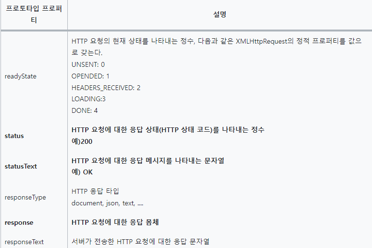
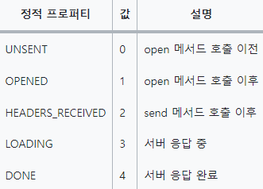
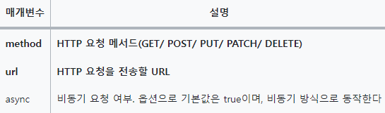

## 43.1 Ajax

- `Ajax`란 자바스크립트를 사용하여 브라우저가 서버에게 비동기 방식으로 데이터를 요청하고, <u>서버가 응답한 데이터를 수신하여 웹페이지를 동적</u>으로 갱신하는 프로그래밍 방식
- 브라우저에서 제공하는 Web API인 XMLHttpRequest 객체를 기반으로 동작
- XMLHttpRequest는 HTTP 비동기 통신을 위한 메서드와 프로퍼티를 제공


<center><b>전통적인 웹페이지의 생명 주기</b></center>
<br/>

- 이전의 웹페이지는 html 태그로 시작해서 html 태그로 끝나는 완전한 HTML을 서버로부터 전송받아 웹페이지 전체를 처음부터 다시 렌더링하는 방식으로 동작 -> 이러한 전통적인 방식은 단점이 존재

  1. 이전 웹페이지와 차이가 없어서 변경할 필요가 없는 부분까지 다시 전송받아 불필요한 데이터 통신 발생
  2. 변경할 필요가 없는 부분까지 처음부터 다시 렌더링, 이로인한 화면 전환으로 화면이 순간적으로 깜빡이는 현상 발생
  3. 클라이언트와 서버와의 통신이 동기 방식으로 동작하기 때문에 서버로부터 응답이 있을때까지 다음 처리는 블로킹

> 💡 Ajax의 등장! => 전통적인 패러다임을 획기적으로 전환 


<center><b>Ajax</b></center>
<br/>

- Ajax의 장점

  1. 변경할 부분을 갱신하는데 필요한 데이터만 서버로부터 전송받기 때문에 불필요한 데이터 통신이 발생하지 않음
  2. 변경할 필요가 없는 부분은 다시 렌더링하지 않음. 따라서 화면이 순간적으로 깜빡이는 현상이 없음
  3. 클라이언트와 서버와의 통신이 비동기 방식으로 동작하기 때문에 서버에게 요청을 보낸 이후 블로킹이 발생하지 않음

## 43.2 JSON

- `JSON`은 클라이언트와 서버 간의 HTTP 통신을 위한 텍스트 데이터 포맷
- 자바스크립트에 종속되지 않는 독립형 데이터 포맷, 대부분의 프로그래밍 언어에서 사용 가능

### 43.2.1 JSON 표기 방식

- 자바스크립트의 객체 리터럴과 유사하게 키와 값으로 구성된 순수한 텍스트

```json
{
  "name": "Lee",
  "age": 20,
  "alive": true,
  "hobby": ["traveling", "tennis"]
}
```

### 43.2.2 JSON.stringify

- `JSON.stringify`메서드는 객체를 JSON 포맷의 문자열로 변환
- 클라이언트가 서버로 객체를 전송하려면 객체를 문자화 => <b>직렬화</b>
  > 👤 => 🗄️

```javascript
const obj = {
  name: 'Lee',
  age: 20,
  alive: true,
  hobby: ['traveling', 'tennis'],
};

// 객체를 JSON 포맷의 문자열로 변환한다.
const json = JSON.stringify(obj);
console.log(typeof json, json);
// string {"name":"Lee","age":20,"alive":true,"hobby":["traveling","tennis"]}

// 객체를 JSON 포맷의 문자열로 변환하면서 들여쓰기 한다.
const prettyJson = JSON.stringify(obj, null, 2);
console.log(typeof prettyJson, prettyJson);
/*
string {
  "name": "Lee",
  "age": 20,
  "alive": true,
  "hobby": [
    "traveling",
    "tennis"
  ]
}
*/

// replacer 함수. 값의 타입이 Number이면 필터링되어 반환되지 않는다.
function filter(key, value) {
  // undefined: 반환하지 않음
  return typeof value === 'number' ? undefined : value;
}

// JSON.stringify 메서드에 두 번째 인수로 replacer 함수를 전달한다.
const strFilteredObject = JSON.stringify(obj, filter, 2);
console.log(typeof strFilteredObject, strFilteredObject);
/*
string {
  "name": "Lee",
  "alive": true,
  "hobby": [
    "traveling",
    "tennis"
  ]
}
*/
```

- `JSON.stringify` 메서드는 객체뿐만 아니라 배열도 JSON 포맷의 문자열로 변환

```javascript
const todos = [
  { id: 1, content: 'HTML', completed: false },
  { id: 2, content: 'CSS', completed: true },
  { id: 3, content: 'Javascript', completed: false },
];

// 배열을 JSON 포맷의 문자열로 변환한다.
const json = JSON.stringify(todos, null, 2);
console.log(typeof json, json);
/*
string [
  {
    "id": 1,
    "content": "HTML",
    "completed": false
  },
  {
    "id": 2,
    "content": "CSS",
    "completed": true
  },
  {
    "id": 3,
    "content": "Javascript",
    "completed": false
  }
]
*/
```

### 43.2.3 JSON.parse

- `JSON.parse` 메서드는 JSON 포맷의 문자열을 객체로 변환
- 서버로부터 클라이언트에게 전송된 JSON 데이터는 문자열이기 때문에 객체로 사용하려면 JSON 포맷의 문자열을 객체화 => <b>역직렬화</b>
  > 🗄️ => 👤

```javascript
const obj = {
  name: 'Lee',
  age: 20,
  alive: true,
  hobby: ['traveling', 'tennis'],
};

// 객체를 JSON 포맷의 문자열로 변환한다.
const json = JSON.stringify(obj);

// JSON 포맷의 문자열을 객체로 변환한다.
const parsed = JSON.parse(json);
console.log(typeof parsed, parsed);
// object {name: "Lee", age: 20, alive: true, hobby: ["traveling", "tennis"]}
```

- 배열이 JSON 포맷의 문자열로 변환되어 있는 경우 `JSON.parse`는 문자열로 배열 객체로 변환
- 배열의 요소가 객체인 경우 배열의 요소까지 객체로 변환

```javascript
const todos = [
  { id: 1, content: 'HTML', completed: false },
  { id: 2, content: 'CSS', completed: true },
  { id: 3, content: 'Javascript', completed: false },
];

// 배열을 JSON 포맷의 문자열로 변환한다.
const json = JSON.stringify(todos);

// JSON 포맷의 문자열을 배열로 변환한다. 배열의 요소까지 객체로 변환된다.
const parsed = JSON.parse(json);
console.log(typeof parsed, parsed);
/*
 object [
  { id: 1, content: 'HTML', completed: false },
  { id: 2, content: 'CSS', completed: true },
  { id: 3, content: 'Javascript', completed: false }
]
*/
```

## 43.3 XMLHttpRequest

- 브라우저는 주소창이나 HTML 의 `form`태그 또는 `a`태그를 통해 HTTP 요청 전송 기능을 기본 제공
- 자바스크립트를 사용하여 HTTP 요청을 전송하려면 `XMLHttpRequest` 객체를 사용

### 43.3.1 XMLHttpRequest 객체 생성

- `XMLHttpRequest` 객체는 `XMLHttpRequest` 생성자 함수를 호출하여 생성
- 브라우저에서 제공하는 Web API이므로 브라우저 환경에서만 정상적으로 실행

```javascript
// XMLHttpRequest 객체 생성
const xhr = new XMLHttpRequest();
```

### 43.3.2 XMLHttpRequest 객체의 프로퍼티와 메서드

- `XMLHttpRequest` 객체는 다양한 프로퍼티와 메서드를 제공

#### XMLHttpRequest 객체의 프로토타입 프로퍼티



#### XMLHttpRequest 객체의 이벤트 핸들러 프로퍼티


#### XMLHttpRequest 객체의 메서드


#### XMLHttpRequest 객체의 정적 프로퍼티



### 43.3.3 HTTP 요청 전송

1. `XMLHttpRequest.prototype.open` 메서드로 HTTP 요청을 초기화
2. 필요에 따라 `XMLHttpRequest.prototype.setRequestHeader` 메서드로 특정 HTTP 요청의 헤더 값을 설정
3. `XMLHttpRequest.prototype.send` 메서드로 HTTP 요청을 전송

```javascript
// XMLHttpRequest 객체 생성
const xhr = new XMLHttpRequest();

// HTTP 요청 초기화
xhr.open('GET', '/users');

// HTTP 요청 헤더 설정
// 클라이언트가 서버로 전송할 데이터의 MIME 타입 지정: json
xhr.setRequestHeader('content-type', 'application/json');

// HTTP 요청 전송
xhr.send();
```

#### XMLHttpRequest.prototype.open

- open 메서드는 서버에 전송할 HTTP 요청을 초기화

  > xhr.open(method, url[,async])

  

- HTTP 요청 메서드는 클라이언트가 서버에게 요청의 종류와 목적(리소스에 대한 행위)을 알리는 방법
  

#### XMLHttpRequest.prototype.send

- send 메서드는 open 메서드로 초기화된 HTTP 요청을 서버에 전송
  > GET 요청 메서드의 경우 데이터를 URL의 일부분인 쿼리 문자열로 서버에 전송
  > POST 요청 메서드의 경우 <u>데이터(페이로드)를 요청 몸체(request body)</u>에 담아 전송
- send 메서드에는 요청 몸체에 담아 전송할 데이터(페이로드)를 인수로 전달할 수 있음
- 페이로드가 객체인 경우 반드시 `JSON.stringify` 메서드를 사용하여 직렬화한 다음 전달

```javascript
xhr.send(JSON.stringify({ id: 1, content: 'HTML', completed: false }));
```

- <b>HTTP 요청메서드가 GET인 경우 send 메서드에 페이로드로 전달한 인수는 무시되고 요청 몸체는 null로 설정</b>

#### XMLHttpRequest.prototype.setRequestHeader

- `setRequestHeader` 메서드는 특정 HTTP 요청의 헤더값을 설정
- 해당 메서드는 반드시 `open` 메서드를 호출한 이후에 호출해야 한다

* Content-type
  - 요청 몸체에 담아 <u>전송할 데이터</u>의 MIME 타입의 정보를 표현
    

```javascript
// XMLHttpRequest 객체 생성
const xhr = new XMLHttpRequest();

// HTTP 요청 초기화
xhr.open('POST', '/users');

// HTTP 요청 헤더 설정
// 클라이언트가 서버로 전송할 데이터의 MIME 타입 지정: json
xhr.setRequestHeader('content-type', 'application/json');

// HTTP 요청 전송
xhr.send(JSON.stringify({ id: 1, content: 'HTML', completed: false }));
```

<center>요청몸체에 담아 서버로 전송할 페이로드의 MIME타입을 지정한 예</center>

- Accept
  - HTTP 클라이언트가 서버에 요청할 때 서버가 응답할 데이터의 MIME타입을 지정할 수 있음
  - Accept 헤더를 설정하지 않으면 `send` 메서드가 호출될 때 `*/*`로 전송

```javascript
// 서버가 응답할 데이터의 MIME 타입 지정: json
xhr.setRequestHeader('accept', 'application/json');
```

<center>서버가 응답할 데이터의 MIME 타입을 지정하는 예</center>

### 43.3.4 HTTP 응답 처리

- 서버가 전송한 응답을 처리하려면 `XMLHttpRequest` 객체가 발생시키는 이벤트를 캐치해야 함
- `readyState` 프로퍼티 값이 변경된 경우 발생하는 `readystatechange` 이벤트를 캐치하여 다음과 같이 HTTP 응답을 처리할 수 있어야함
- HTTP 요청을 전송하고 응답을 받으려면 서버가 필요!

```javascript
// XMLHttpRequest 객체 생성
const xhr = new XMLHttpRequest();

// HTTP 요청 초기화
// https://jsonplaceholder.typicode.com은 Fake REST API를 제공하는 서비스다.
xhr.open('GET', 'https://jsonplaceholder.typicode.com/todos/1');

// HTTP 요청 전송
xhr.send();

// readystatechange 이벤트는 HTTP 요청의 현재 상태를 나타내는 readyState 프로퍼티가
// 변경될 때마다 발생한다.
🌙 xhr.onreadystatechange = () => {
  // readyState 프로퍼티는 HTTP 요청의 현재 상태를 나타낸다.
  // readyState 프로퍼티 값이 4(XMLHttpRequest.DONE)가 아니면 서버 응답이 완료되지 상태다.
  // 만약 서버 응답이 아직 완료되지 않았다면 아무런 처리를 하지 않는다.
  if (xhr.readyState !== XMLHttpRequest.DONE) return;

  // status 프로퍼티는 응답 상태 코드를 나타낸다.
  // status 프로퍼티 값이 200이면 정상적으로 응답된 상태이고
  // status 프로퍼티 값이 200이 아니면 에러가 발생한 상태다.
  // 정상적으로 응답된 상태라면 response 프로퍼티에 서버의 응답 결과가 담겨 있다.
  if (xhr.status === 200) {
     ☀️ console.log(JSON.parse(xhr.response));
    // {userId: 1, id: 1, title: "delectus aut autem", completed: false}
  } else {
    console.error('Error', xhr.status, xhr.statusText);
  }
};
```

- `send` 메서드를 통해 HTTP 요청을 서버에 전송하면 서버는 응답을 반환
- 언제 응답이 클라이언트에 도달할지는 알 수 없기 때문에 `readystatechange`이벤트를 통해 HTTP 요청의 현재 상태를 확인해야함 => `readystatechange` 이벤트는 HTTP 요청의 현재 상태를 나타내는 `readyState` 프로퍼티가 변경될 때마다 발생
- 🌙 `onreadystatechange` 이벤트 핸들러 프로퍼티에 할당한 이벤트 핸들러는 HTTP 요청의 현재 상태를 나타내는 `xhr.readyState`가 `XMLHttpRequest.DONE` 인지 확인하여 서버의 응답이 완료되었는지 확인
- ☀️ 서버의 응답이 완료되면 응답코드가 200인지 확인하여 정상 처리와 에러 처리를 구분

```javascript
// XMLHttpRequest 객체 생성
const xhr = new XMLHttpRequest();

// HTTP 요청 초기화
// https://jsonplaceholder.typicode.com은 Fake REST API를 제공하는 서비스다.
xhr.open('GET', 'https://jsonplaceholder.typicode.com/todos/1');

// HTTP 요청 전송
xhr.send();

// load 이벤트는 HTTP 요청이 성공적으로 완료된 경우 발생한다.
xhr.onload = () => {
  // status 프로퍼티는 응답 상태 코드를 나타낸다.
  // status 프로퍼티 값이 200이면 정상적으로 응답된 상태이고
  // status 프로퍼티 값이 200이 아니면 에러가 발생한 상태다.
  // 정상적으로 응답된 상태라면 response 프로퍼티에 서버의 응답 결과가 담겨 있다.
  if (xhr.status === 200) {
    console.log(JSON.parse(xhr.response));
    // {userId: 1, id: 1, title: "delectus aut autem", completed: false}
  } else {
    console.error('Error', xhr.status, xhr.statusText);
  }
};
```

- `load` 이벤트를 캐리하는 것도 좋은 방법!
- HTTP 요청이 성공적으로 완료된 경우 발생
- `load` 이벤트를 캐리하는 경우 `xhr.readyState`가 `XHMLHttpRequest.DONE` 인지 확인할 필요가 없음
